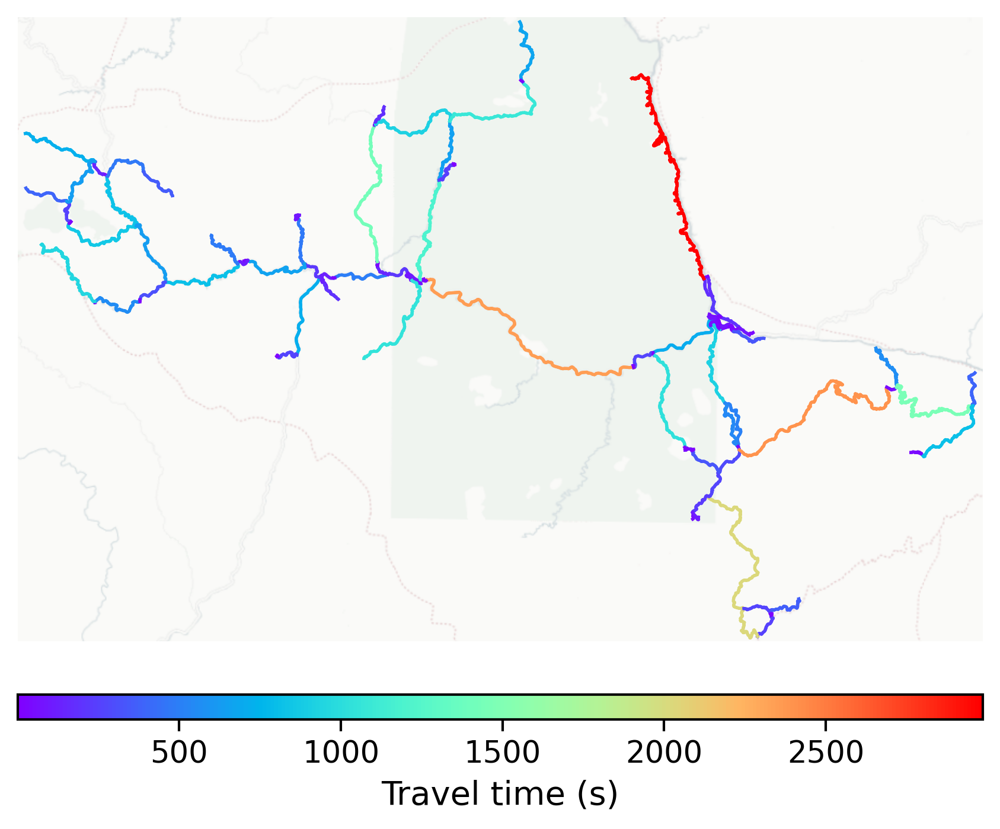

# Muang_Khua, Laos

#### Location Information

- **City**: Muang_Khua
- **Country**: Laos
- **Data Source**: OpenStreetMap

- **Analysis Date**: 2025-10-10

#### Road network topology

#### Network Characteristics

##### Basic Topology

- **Number of Nodes**: 137
- **Number of Edges**: 306
- **Network Density**: 0.016423
- **Average Node Degree**: 4.467
- **Standard Deviation of Node Degrees**: 1.937

##### Clustering Properties

- **Global Clustering Coefficient**: 0.037975
- **Average Local Clustering Coefficient**: 0.042146
- **Degree Assortativity Coefficient**: -0.176591

##### Spatial Metrics

- **Total Network Length (meters)**: 702301.03
- **Average Edge Length (meters)**: 2295.10
- **Average Travel Time per Edge (seconds)**: 275.41

---
*Report generated on 2025-10-10 18:26:45*
