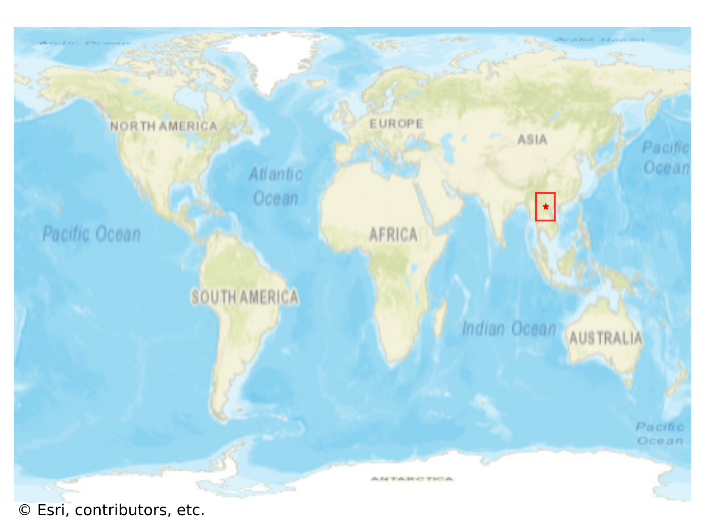

# Muang_Ngoi, Laos

#### Location Information

- **City**: Muang_Ngoi
- **Country**: Laos
- **Data Source**: OpenStreetMap

- **Analysis Date**: 2025-10-10

#### Road network topology

#### Network Characteristics

##### Basic Topology

- **Number of Nodes**: 35
- **Number of Edges**: 86
- **Network Density**: 0.072269
- **Average Node Degree**: 4.914
- **Standard Deviation of Node Degrees**: 1.746

##### Clustering Properties

- **Global Clustering Coefficient**: 0.039474
- **Average Local Clustering Coefficient**: 0.037037
- **Degree Assortativity Coefficient**: -0.016548

##### Spatial Metrics

- **Total Network Length (meters)**: 22805.38
- **Average Edge Length (meters)**: 265.18
- **Average Travel Time per Edge (seconds)**: 31.82

---
*Report generated on 2025-10-10 18:26:46*
