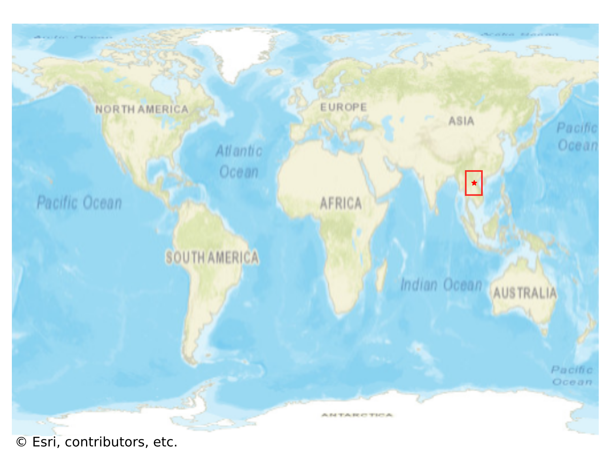
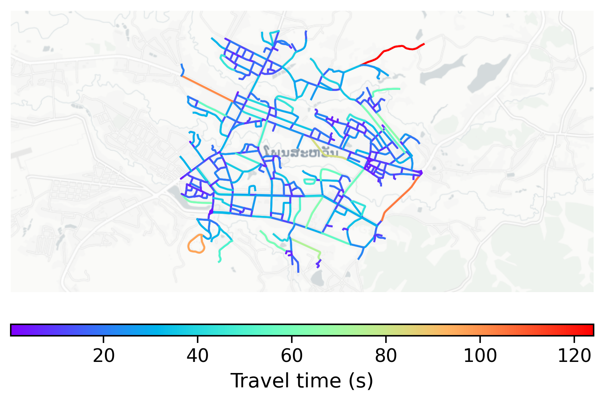

# Phonsavan, Laos

#### Location Information

- **City**: Phonsavan
- **Country**: Laos
- **Data Source**: OpenStreetMap

- **Analysis Date**: 2025-10-09

#### Road network topology

#### Network Characteristics

##### Basic Topology

- **Number of Nodes**: 417
- **Number of Edges**: 1,080
- **Network Density**: 0.006226
- **Average Node Degree**: 5.180
- **Standard Deviation of Node Degrees**: 1.693

##### Clustering Properties

- **Global Clustering Coefficient**: 0.051351
- **Average Local Clustering Coefficient**: 0.051724
- **Degree Assortativity Coefficient**: 0.178913

##### Spatial Metrics

- **Total Network Length (meters)**: 156997.33
- **Average Edge Length (meters)**: 145.37
- **Average Travel Time per Edge (seconds)**: 17.44

---
*Report generated on 2025-10-09 19:19:28*
