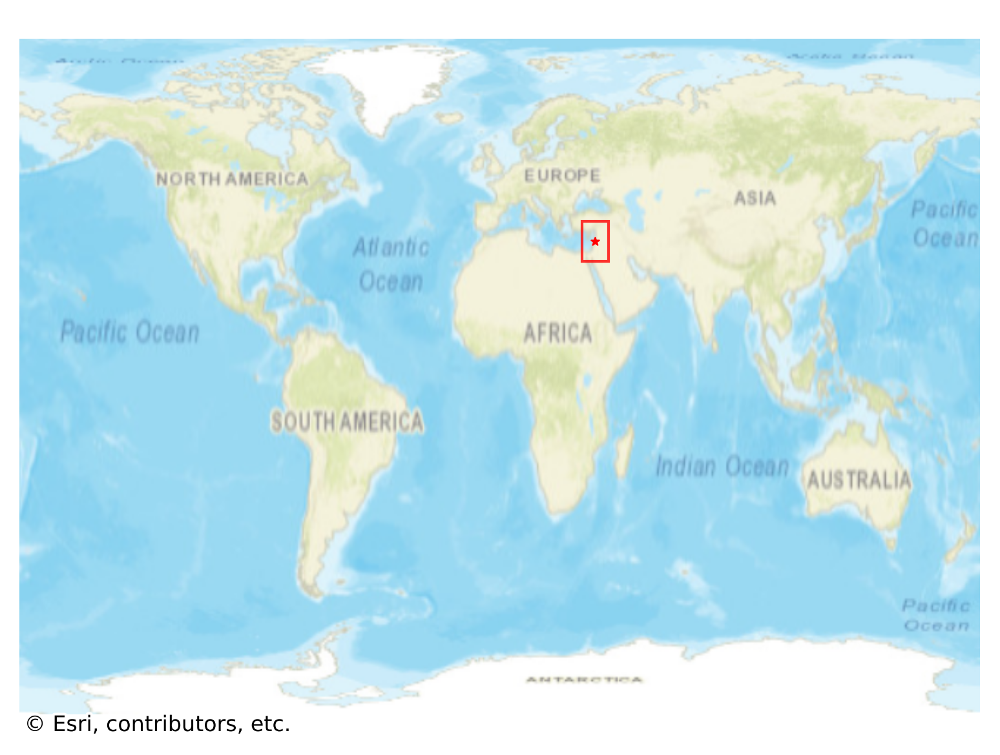
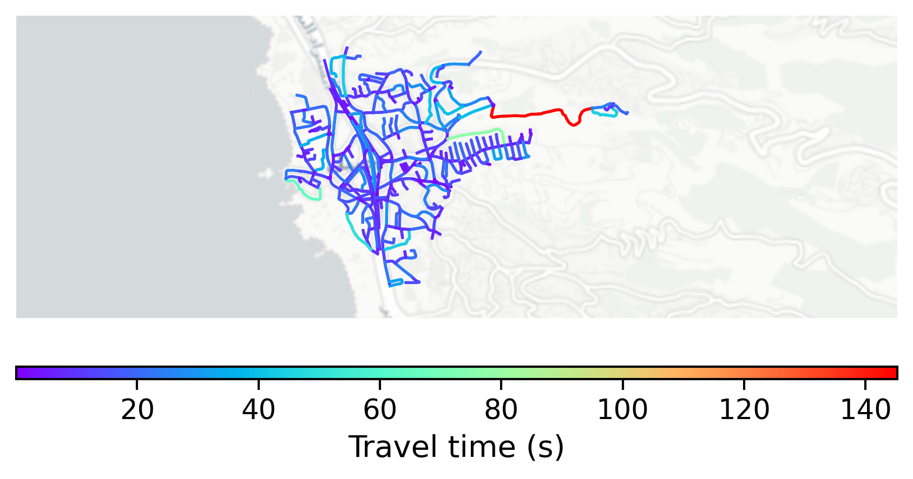

# Byblos, Lebanon

#### Location Information

- **City**: Byblos
- **Country**: Lebanon
- **Data Source**: OpenStreetMap

- **Analysis Date**: 2025-10-10

#### Road network topology

#### Network Characteristics

##### Basic Topology

- **Number of Nodes**: 378
- **Number of Edges**: 842
- **Network Density**: 0.005909
- **Average Node Degree**: 4.455
- **Standard Deviation of Node Degrees**: 1.767

##### Clustering Properties

- **Global Clustering Coefficient**: 0.094837
- **Average Local Clustering Coefficient**: 0.093960
- **Degree Assortativity Coefficient**: 0.097210

##### Spatial Metrics

- **Total Network Length (meters)**: 85878.24
- **Average Edge Length (meters)**: 101.99
- **Average Travel Time per Edge (seconds)**: 11.63

---
*Report generated on 2025-10-10 18:26:50*
