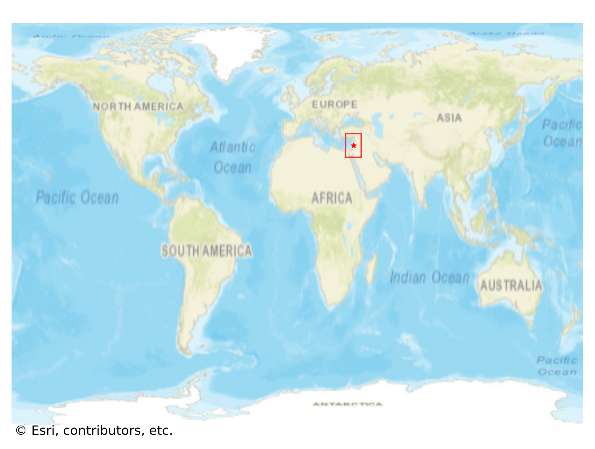
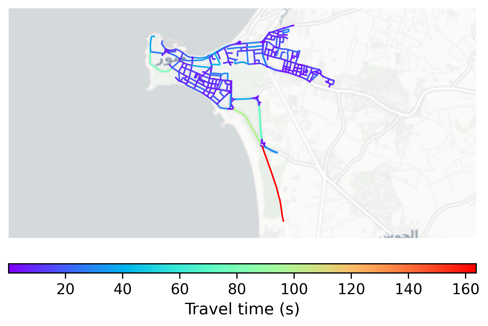

# Tyre, Lebanon

#### Location Information

- **City**: Tyre
- **Country**: Lebanon
- **Data Source**: OpenStreetMap

- **Analysis Date**: 2025-10-10

#### Road network topology

#### Network Characteristics

##### Basic Topology

- **Number of Nodes**: 336
- **Number of Edges**: 781
- **Network Density**: 0.006939
- **Average Node Degree**: 4.649
- **Standard Deviation of Node Degrees**: 1.710

##### Clustering Properties

- **Global Clustering Coefficient**: 0.070988
- **Average Local Clustering Coefficient**: 0.084708
- **Degree Assortativity Coefficient**: 0.394620

##### Spatial Metrics

- **Total Network Length (meters)**: 66077.83
- **Average Edge Length (meters)**: 84.61
- **Average Travel Time per Edge (seconds)**: 10.15

---
*Report generated on 2025-10-10 16:09:20*
