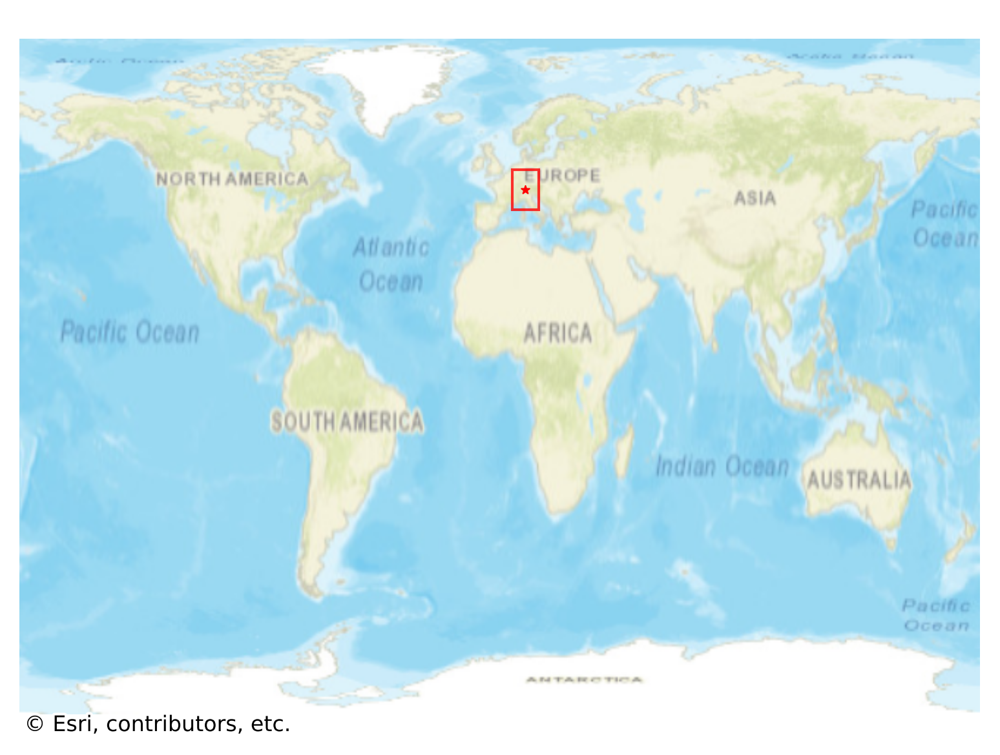

# Vaduz, Liechtenstein

#### Location Information

- **City**: Vaduz
- **Country**: Liechtenstein
- **Data Source**: OpenStreetMap

- **Analysis Date**: 2025-10-10

#### Road network topology

#### Network Characteristics

##### Basic Topology

- **Number of Nodes**: 256
- **Number of Edges**: 594
- **Network Density**: 0.009099
- **Average Node Degree**: 4.641
- **Standard Deviation of Node Degrees**: 1.793

##### Clustering Properties

- **Global Clustering Coefficient**: 0.084859
- **Average Local Clustering Coefficient**: 0.082915
- **Degree Assortativity Coefficient**: 0.153298

##### Spatial Metrics

- **Total Network Length (meters)**: 76046.07
- **Average Edge Length (meters)**: 128.02
- **Average Travel Time per Edge (seconds)**: 10.86

---
*Report generated on 2025-10-10 16:09:22*
