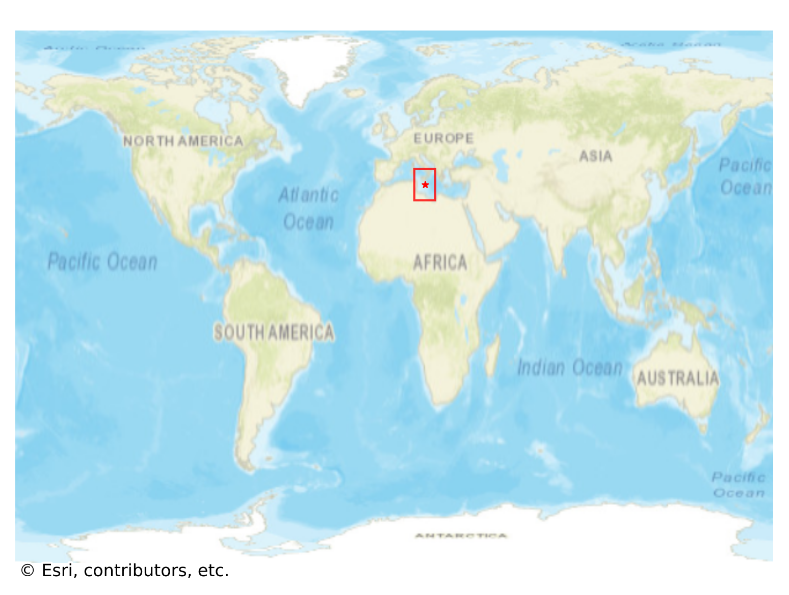
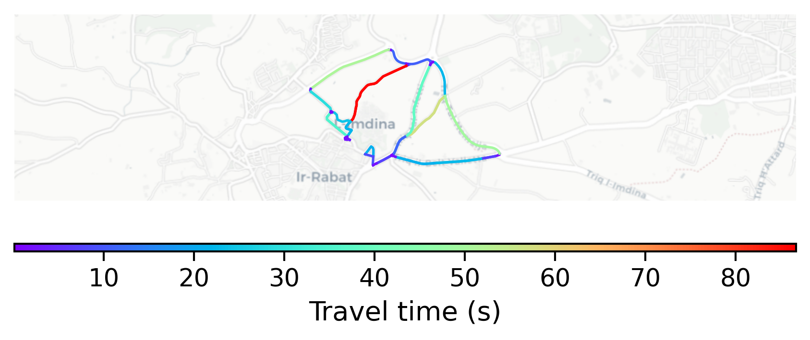

# Mdina, Malta

#### Location Information

- **City**: Mdina
- **Country**: Malta
- **Data Source**: OpenStreetMap

- **Analysis Date**: 2025-10-10

#### Road network topology

#### Network Characteristics

##### Basic Topology

- **Number of Nodes**: 42
- **Number of Edges**: 65
- **Network Density**: 0.037747
- **Average Node Degree**: 3.095
- **Standard Deviation of Node Degrees**: 1.191

##### Clustering Properties

- **Global Clustering Coefficient**: 0.222222
- **Average Local Clustering Coefficient**: 0.179167
- **Degree Assortativity Coefficient**: 0.378482

##### Spatial Metrics

- **Total Network Length (meters)**: 10739.13
- **Average Edge Length (meters)**: 165.22
- **Average Travel Time per Edge (seconds)**: 14.42

---
*Report generated on 2025-10-10 16:09:24*
