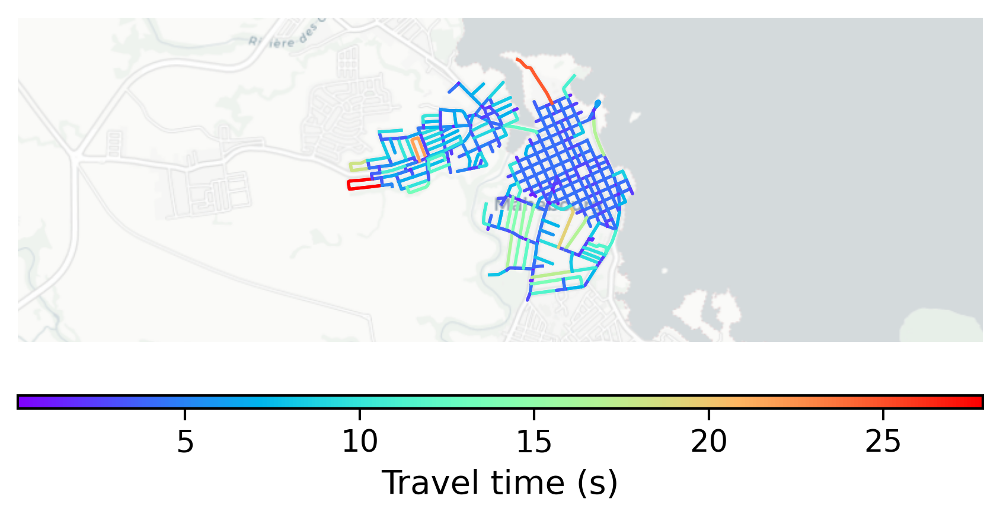

# Mahébourg, Mauritius

#### Location Information

- **City**: Mahébourg
- **Country**: Mauritius
- **Data Source**: OpenStreetMap

- **Analysis Date**: 2025-10-09

#### Road network topology

#### Network Characteristics

##### Basic Topology

- **Number of Nodes**: 321
- **Number of Edges**: 923
- **Network Density**: 0.008986
- **Average Node Degree**: 5.751
- **Standard Deviation of Node Degrees**: 1.983

##### Clustering Properties

- **Global Clustering Coefficient**: 0.040286
- **Average Local Clustering Coefficient**: 0.038538
- **Degree Assortativity Coefficient**: 0.182627

##### Spatial Metrics

- **Total Network Length (meters)**: 71297.36
- **Average Edge Length (meters)**: 77.25
- **Average Travel Time per Edge (seconds)**: 4.66

---
*Report generated on 2025-10-09 19:19:30*
