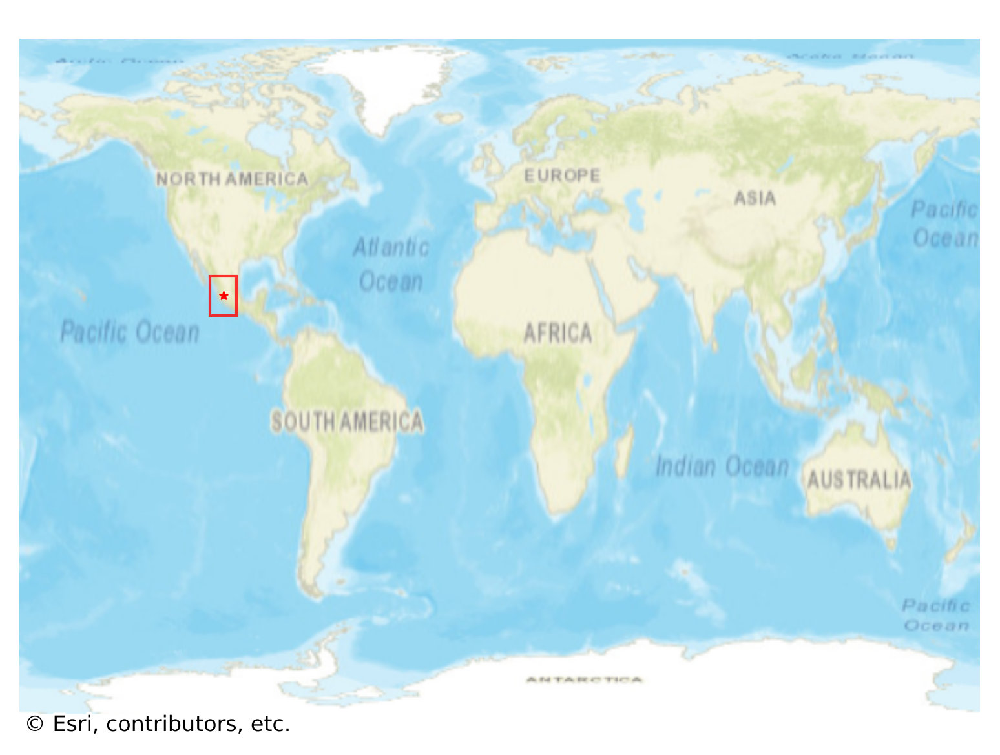
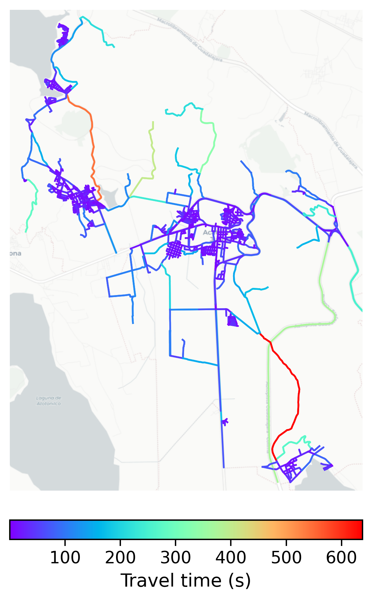

# Acatlan, Mexico

#### Location Information

- **City**: Acatlan
- **Country**: Mexico
- **Data Source**: OpenStreetMap

- **Analysis Date**: 2025-10-10

#### Road network topology

#### Network Characteristics

##### Basic Topology

- **Number of Nodes**: 917
- **Number of Edges**: 2,427
- **Network Density**: 0.002889
- **Average Node Degree**: 5.293
- **Standard Deviation of Node Degrees**: 1.913

##### Clustering Properties

- **Global Clustering Coefficient**: 0.057218
- **Average Local Clustering Coefficient**: 0.062196
- **Degree Assortativity Coefficient**: 0.167692

##### Spatial Metrics

- **Total Network Length (meters)**: 435784.27
- **Average Edge Length (meters)**: 179.56
- **Average Travel Time per Edge (seconds)**: 24.81

---
*Report generated on 2025-10-10 16:09:30*
