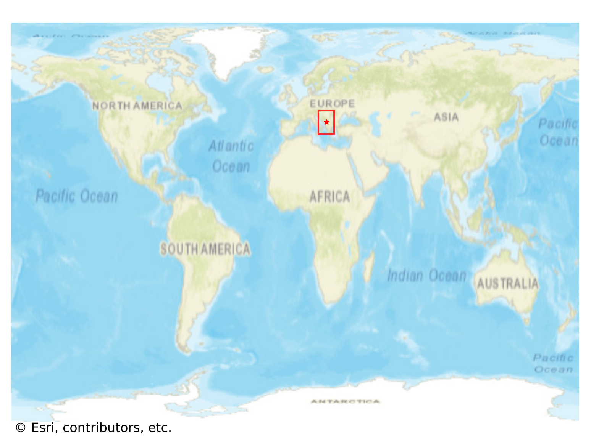
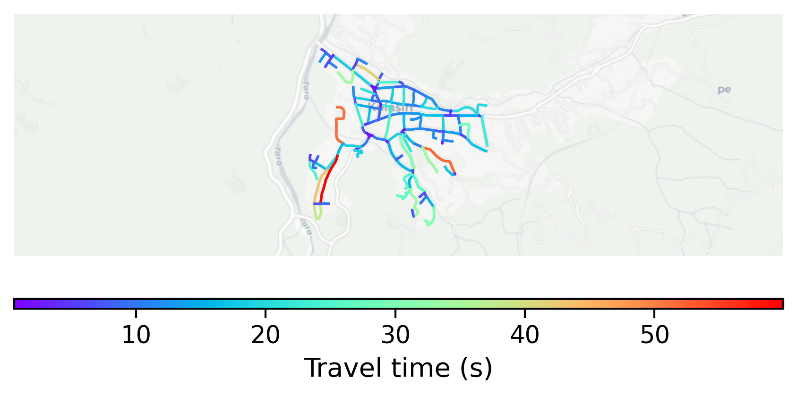

# Kolašin, Montenegro

#### Location Information

- **City**: Kolašin
- **Country**: Montenegro
- **Data Source**: OpenStreetMap

- **Analysis Date**: 2025-10-10

#### Road network topology

#### Network Characteristics

##### Basic Topology

- **Number of Nodes**: 123
- **Number of Edges**: 275
- **Network Density**: 0.018326
- **Average Node Degree**: 4.472
- **Standard Deviation of Node Degrees**: 1.796

##### Clustering Properties

- **Global Clustering Coefficient**: 0.045627
- **Average Local Clustering Coefficient**: 0.044944
- **Degree Assortativity Coefficient**: 0.003830

##### Spatial Metrics

- **Total Network Length (meters)**: 29353.28
- **Average Edge Length (meters)**: 106.74
- **Average Travel Time per Edge (seconds)**: 12.90

---
*Report generated on 2025-10-10 16:09:35*
