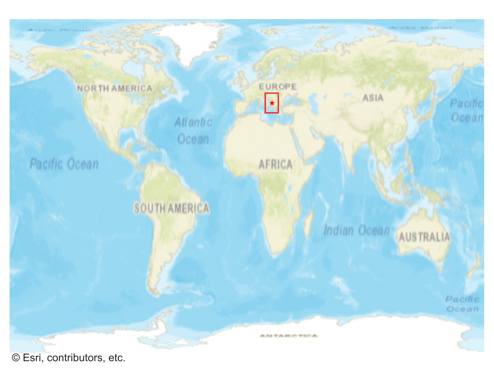
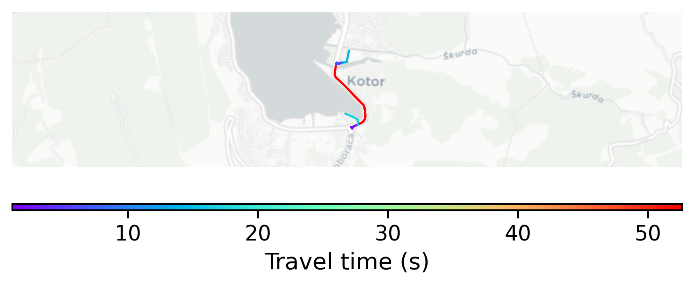

# Kotor, Montenegro

#### Location Information

- **City**: Kotor
- **Country**: Montenegro
- **Data Source**: OpenStreetMap

- **Analysis Date**: 2025-10-10

#### Road network topology

#### Network Characteristics

##### Basic Topology

- **Number of Nodes**: 9
- **Number of Edges**: 14
- **Network Density**: 0.194444
- **Average Node Degree**: 3.111
- **Standard Deviation of Node Degrees**: 1.523

##### Clustering Properties

- **Global Clustering Coefficient**: 0.400000
- **Average Local Clustering Coefficient**: 0.571429
- **Degree Assortativity Coefficient**: -0.155902

##### Spatial Metrics

- **Total Network Length (meters)**: 1825.71
- **Average Edge Length (meters)**: 130.41
- **Average Travel Time per Edge (seconds)**: 12.82

---
*Report generated on 2025-10-10 18:27:10*
