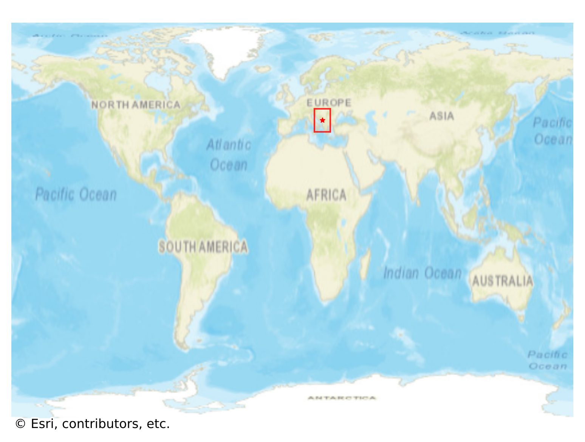
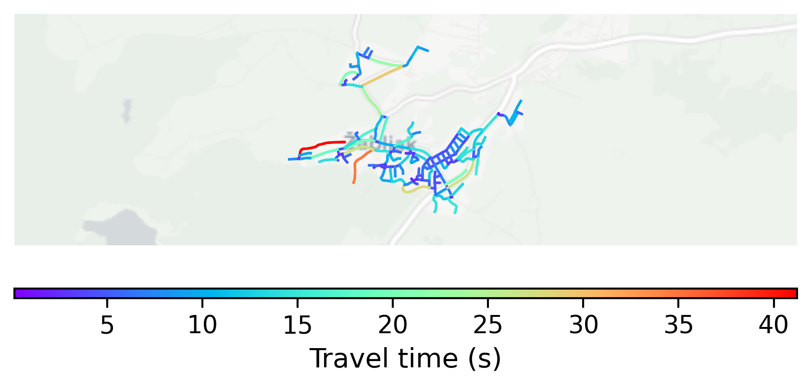

# Žabljak, Montenegro

#### Location Information

- **City**: Žabljak
- **Country**: Montenegro
- **Data Source**: OpenStreetMap

- **Analysis Date**: 2025-10-10

#### Road network topology

#### Network Characteristics

##### Basic Topology

- **Number of Nodes**: 147
- **Number of Edges**: 350
- **Network Density**: 0.016308
- **Average Node Degree**: 4.762
- **Standard Deviation of Node Degrees**: 1.984

##### Clustering Properties

- **Global Clustering Coefficient**: 0.028662
- **Average Local Clustering Coefficient**: 0.022876
- **Degree Assortativity Coefficient**: 0.022838

##### Spatial Metrics

- **Total Network Length (meters)**: 33155.15
- **Average Edge Length (meters)**: 94.73
- **Average Travel Time per Edge (seconds)**: 8.11

---
*Report generated on 2025-10-10 16:09:39*
