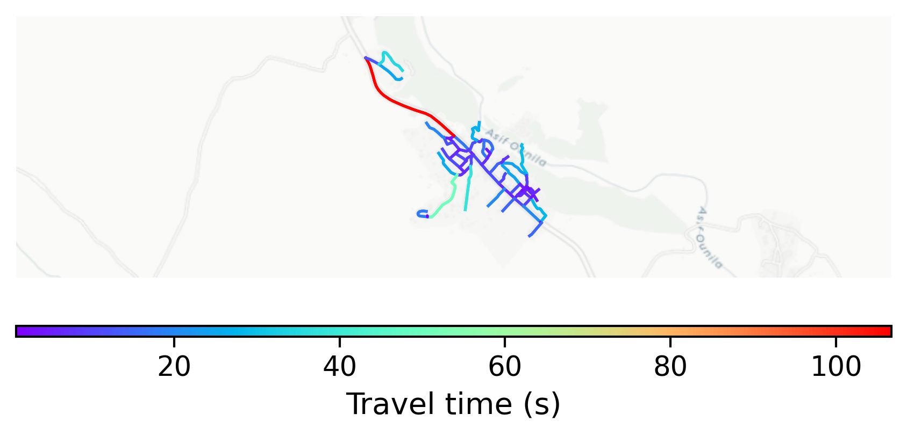

# Ait_Ben_Haddou, Morocco

#### Location Information

- **City**: Ait_Ben_Haddou
- **Country**: Morocco
- **Data Source**: OpenStreetMap

- **Analysis Date**: 2025-10-10

#### Road network topology

#### Network Characteristics

##### Basic Topology

- **Number of Nodes**: 63
- **Number of Edges**: 156
- **Network Density**: 0.039939
- **Average Node Degree**: 4.952
- **Standard Deviation of Node Degrees**: 1.979

##### Clustering Properties

- **Global Clustering Coefficient**: 0.085106
- **Average Local Clustering Coefficient**: 0.081481
- **Degree Assortativity Coefficient**: -0.048847

##### Spatial Metrics

- **Total Network Length (meters)**: 16059.10
- **Average Edge Length (meters)**: 102.94
- **Average Travel Time per Edge (seconds)**: 12.35

---
*Report generated on 2025-10-10 18:27:14*
