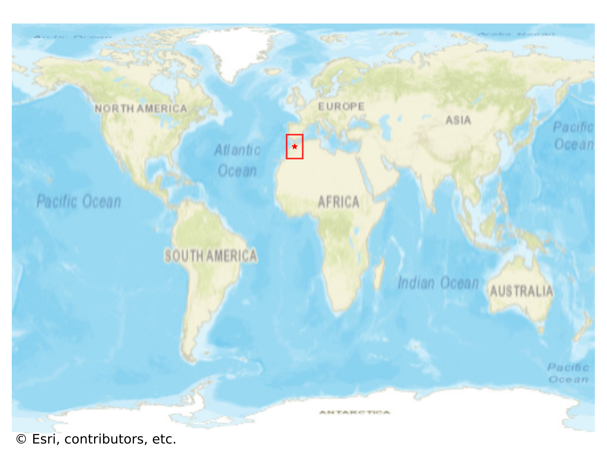
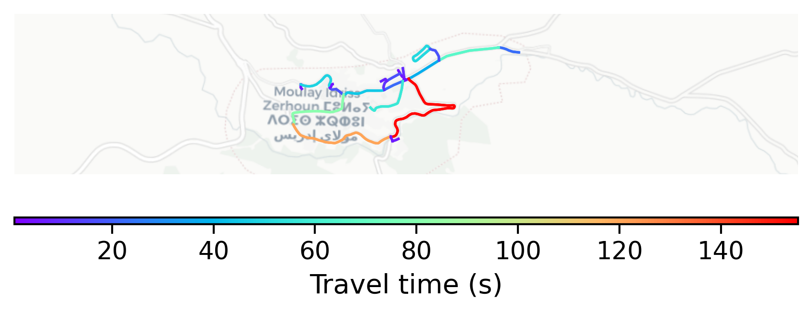

# Moulay_Idriss, Morocco

#### Location Information

- **City**: Moulay_Idriss
- **Country**: Morocco
- **Data Source**: OpenStreetMap

- **Analysis Date**: 2025-10-10

#### Road network topology

#### Network Characteristics

##### Basic Topology

- **Number of Nodes**: 26
- **Number of Edges**: 58
- **Network Density**: 0.089231
- **Average Node Degree**: 4.462
- **Standard Deviation of Node Degrees**: 1.781

##### Clustering Properties

- **Global Clustering Coefficient**: 0.069767
- **Average Local Clustering Coefficient**: 0.058824
- **Degree Assortativity Coefficient**: 0.068807

##### Spatial Metrics

- **Total Network Length (meters)**: 13883.67
- **Average Edge Length (meters)**: 239.37
- **Average Travel Time per Edge (seconds)**: 28.72

---
*Report generated on 2025-10-10 18:27:15*
