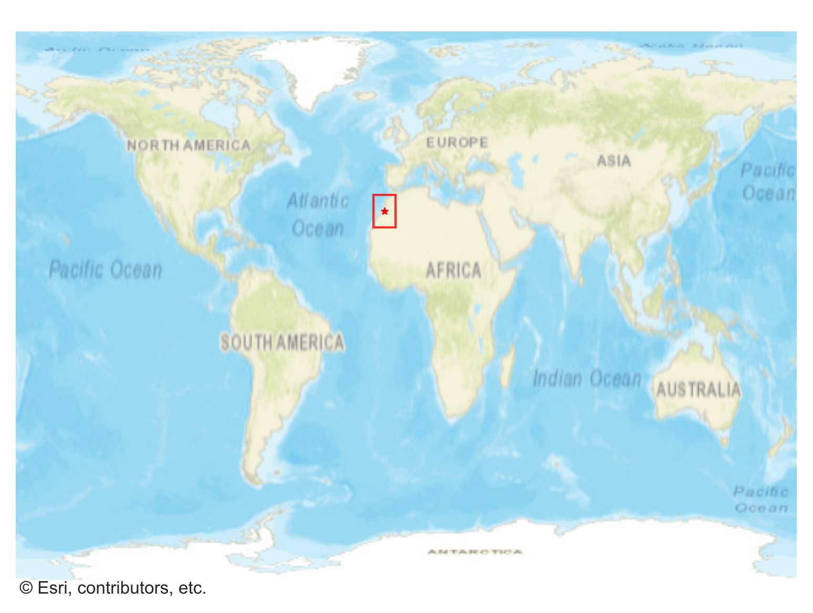
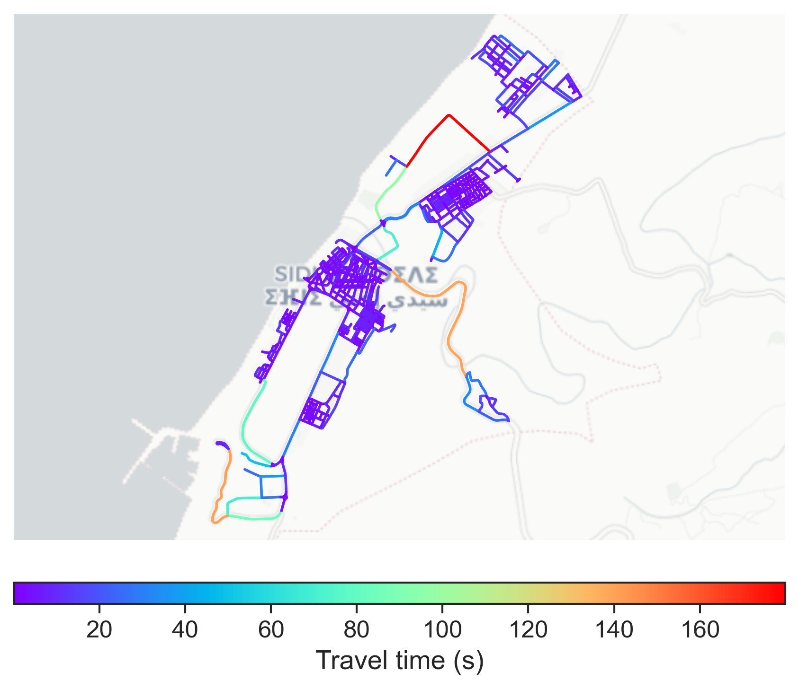

# Sidi_Ifni, Morocco

#### Location Information

- **City**: Sidi_Ifni
- **Country**: Morocco
- **Data Source**: OpenStreetMap

- **Analysis Date**: 2025-10-10

#### Road network topology

#### Network Characteristics

##### Basic Topology

- **Number of Nodes**: 732
- **Number of Edges**: 2,082
- **Network Density**: 0.003891
- **Average Node Degree**: 5.689
- **Standard Deviation of Node Degrees**: 1.599

##### Clustering Properties

- **Global Clustering Coefficient**: 0.050890
- **Average Local Clustering Coefficient**: 0.055637
- **Degree Assortativity Coefficient**: 0.389173

##### Spatial Metrics

- **Total Network Length (meters)**: 158986.09
- **Average Edge Length (meters)**: 76.36
- **Average Travel Time per Edge (seconds)**: 5.22

---
*Report generated on 2025-10-10 16:09:44*
