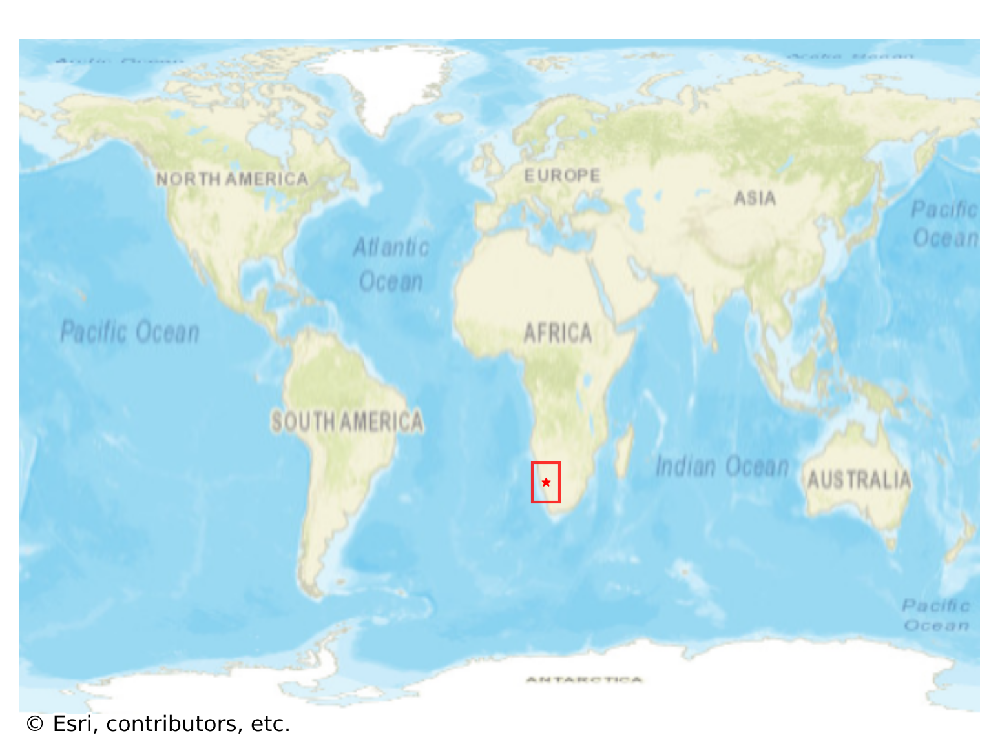

# Bethanie, Namibia

#### Location Information

- **City**: Bethanie
- **Country**: Namibia
- **Data Source**: OpenStreetMap

- **Analysis Date**: 2025-10-10

#### Road network topology

#### Network Characteristics

##### Basic Topology

- **Number of Nodes**: 70
- **Number of Edges**: 212
- **Network Density**: 0.043892
- **Average Node Degree**: 6.057
- **Standard Deviation of Node Degrees**: 1.548

##### Clustering Properties

- **Global Clustering Coefficient**: 0.092511
- **Average Local Clustering Coefficient**: 0.089947
- **Degree Assortativity Coefficient**: 0.087907

##### Spatial Metrics

- **Total Network Length (meters)**: 39743.73
- **Average Edge Length (meters)**: 187.47
- **Average Travel Time per Edge (seconds)**: 10.49

---
*Report generated on 2025-10-10 18:27:19*
