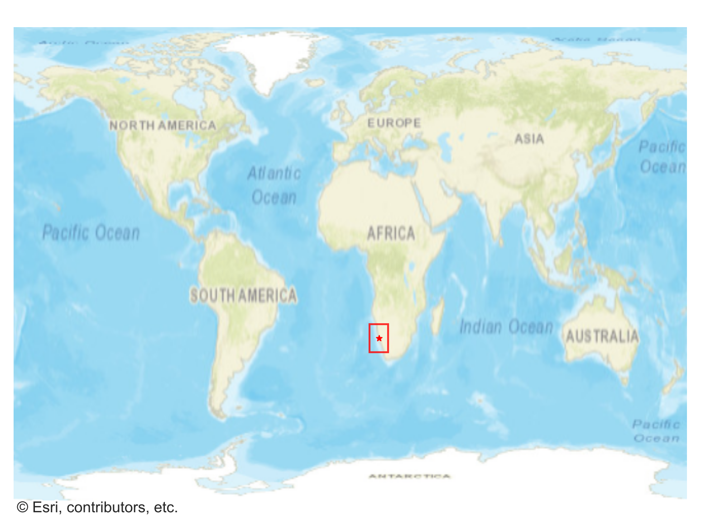
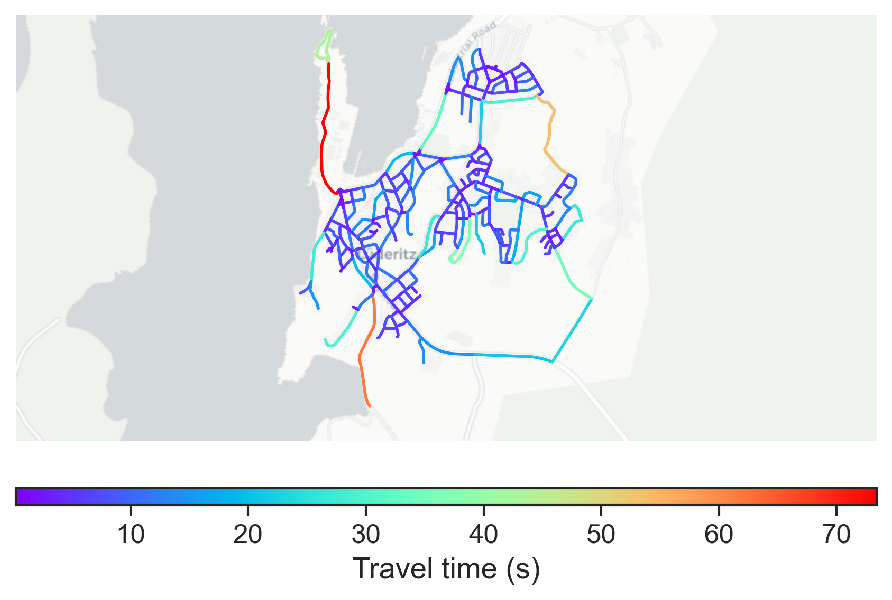

# Luderitz, Namibia

#### Location Information

- **City**: Luderitz
- **Country**: Namibia
- **Data Source**: OpenStreetMap

- **Analysis Date**: 2025-10-10

#### Road network topology

#### Network Characteristics

##### Basic Topology

- **Number of Nodes**: 247
- **Number of Edges**: 663
- **Network Density**: 0.010911
- **Average Node Degree**: 5.368
- **Standard Deviation of Node Degrees**: 1.639

##### Clustering Properties

- **Global Clustering Coefficient**: 0.104046
- **Average Local Clustering Coefficient**: 0.103583
- **Degree Assortativity Coefficient**: 0.067647

##### Spatial Metrics

- **Total Network Length (meters)**: 84755.16
- **Average Edge Length (meters)**: 127.84
- **Average Travel Time per Edge (seconds)**: 7.51

---
*Report generated on 2025-10-10 18:27:20*
