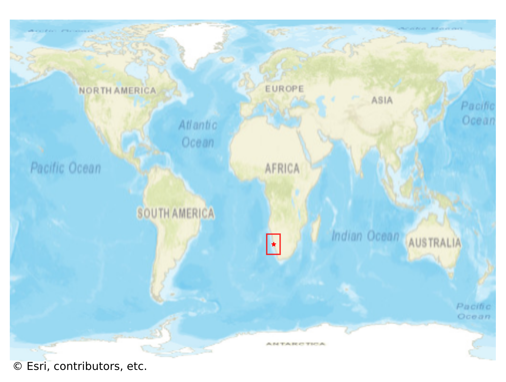
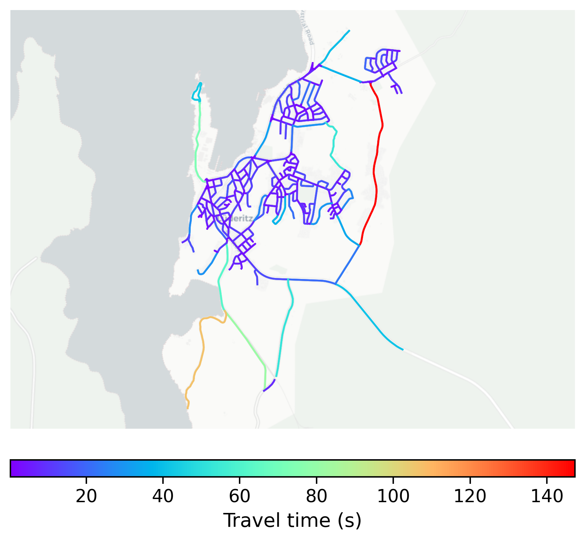

# Lüderitz, Namibia

#### Location Information

- **City**: Lüderitz
- **Country**: Namibia
- **Data Source**: OpenStreetMap

- **Analysis Date**: 2025-10-09

#### Road network topology

#### Network Characteristics

##### Basic Topology

- **Number of Nodes**: 299
- **Number of Edges**: 797
- **Network Density**: 0.008945
- **Average Node Degree**: 5.331
- **Standard Deviation of Node Degrees**: 1.672

##### Clustering Properties

- **Global Clustering Coefficient**: 0.110451
- **Average Local Clustering Coefficient**: 0.107190
- **Degree Assortativity Coefficient**: 0.074898

##### Spatial Metrics

- **Total Network Length (meters)**: 118458.59
- **Average Edge Length (meters)**: 148.63
- **Average Travel Time per Edge (seconds)**: 8.55

---
*Report generated on 2025-10-09 19:19:53*
