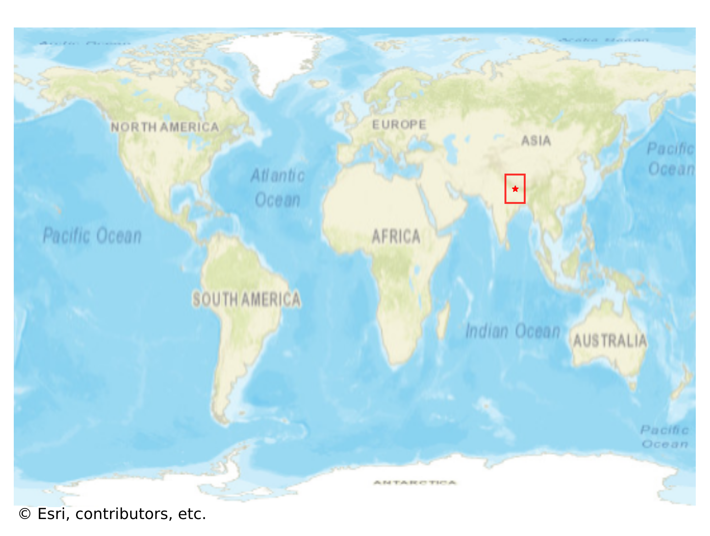
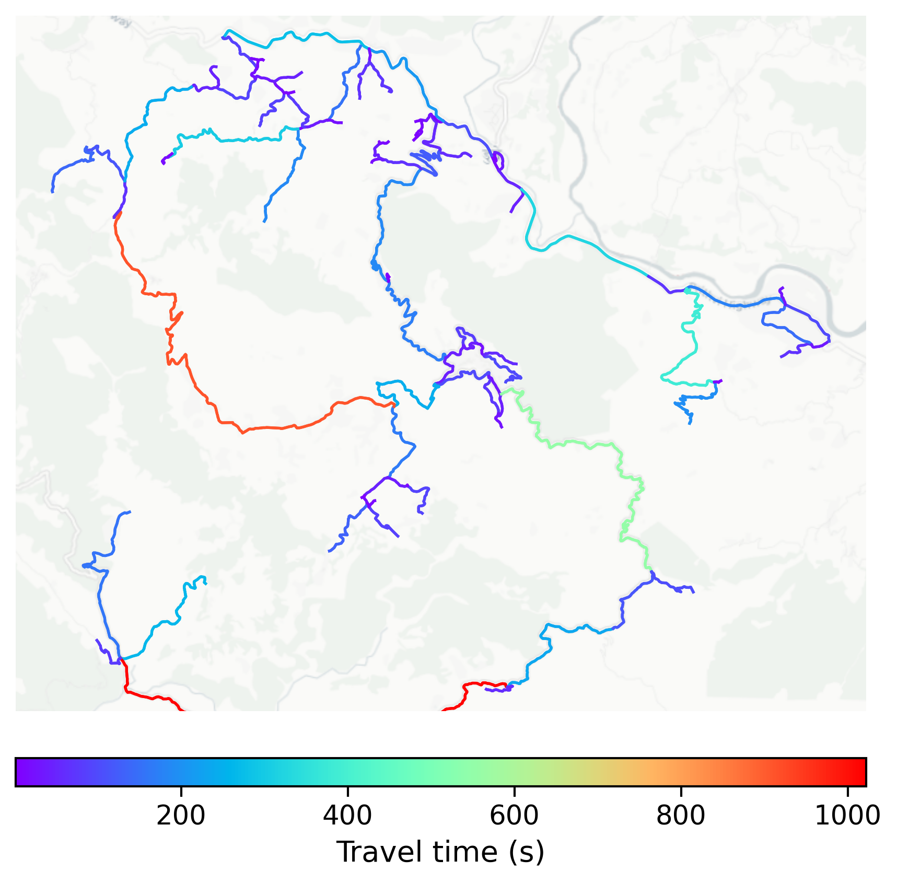

# Bandipur, Nepal

#### Location Information

- **City**: Bandipur
- **Country**: Nepal
- **Data Source**: OpenStreetMap

- **Analysis Date**: 2025-10-10

#### Road network topology

#### Network Characteristics

##### Basic Topology

- **Number of Nodes**: 104
- **Number of Edges**: 218
- **Network Density**: 0.020351
- **Average Node Degree**: 4.192
- **Standard Deviation of Node Degrees**: 1.952

##### Clustering Properties

- **Global Clustering Coefficient**: 0.054545
- **Average Local Clustering Coefficient**: 0.057377
- **Degree Assortativity Coefficient**: -0.308154

##### Spatial Metrics

- **Total Network Length (meters)**: 189409.13
- **Average Edge Length (meters)**: 868.85
- **Average Travel Time per Edge (seconds)**: 95.84

---
*Report generated on 2025-10-10 18:27:24*
