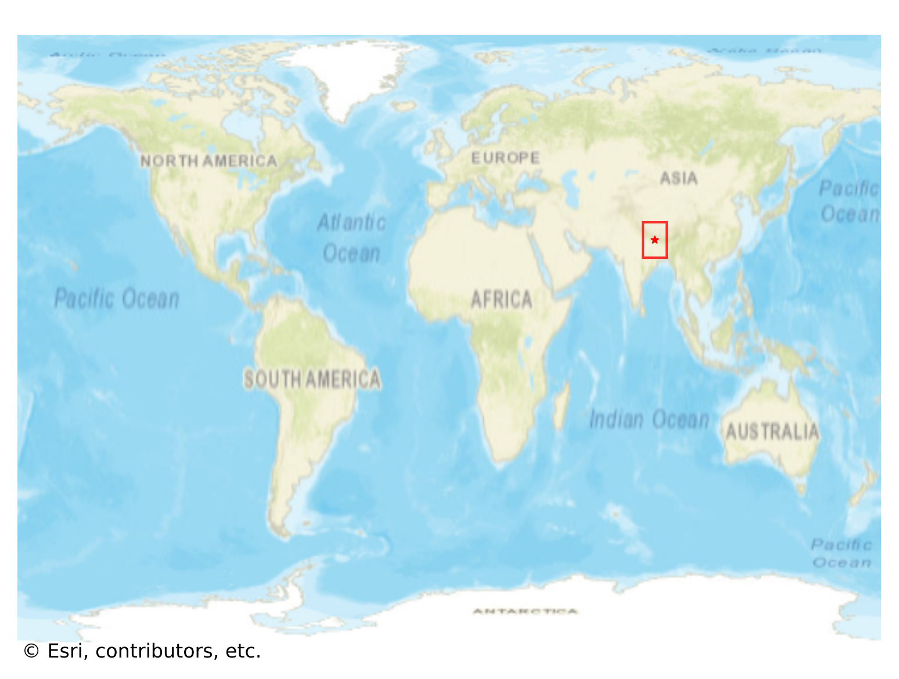

# Nagarkot, Nepal

#### Location Information

- **City**: Nagarkot
- **Country**: Nepal
- **Data Source**: OpenStreetMap

- **Analysis Date**: 2025-10-10

#### Road network topology

#### Network Characteristics

##### Basic Topology

- **Number of Nodes**: 76
- **Number of Edges**: 162
- **Network Density**: 0.028421
- **Average Node Degree**: 4.263
- **Standard Deviation of Node Degrees**: 1.929

##### Clustering Properties

- **Global Clustering Coefficient**: 0.094488
- **Average Local Clustering Coefficient**: 0.108696
- **Degree Assortativity Coefficient**: -0.169340

##### Spatial Metrics

- **Total Network Length (meters)**: 81482.07
- **Average Edge Length (meters)**: 502.98
- **Average Travel Time per Edge (seconds)**: 76.11

---
*Report generated on 2025-10-10 16:09:55*
