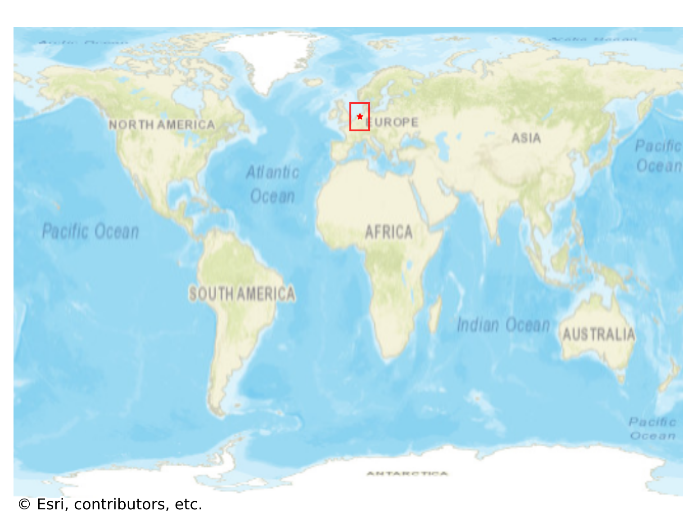

# Giethoorn, Netherlands

#### Location Information

- **City**: Giethoorn
- **Country**: Netherlands
- **Data Source**: OpenStreetMap

- **Analysis Date**: 2025-10-10

#### Road network topology

#### Network Characteristics

##### Basic Topology

- **Number of Nodes**: 178
- **Number of Edges**: 396
- **Network Density**: 0.012569
- **Average Node Degree**: 4.449
- **Standard Deviation of Node Degrees**: 1.923

##### Clustering Properties

- **Global Clustering Coefficient**: 0.134078
- **Average Local Clustering Coefficient**: 0.122043
- **Degree Assortativity Coefficient**: -0.038782

##### Spatial Metrics

- **Total Network Length (meters)**: 119638.47
- **Average Edge Length (meters)**: 302.12
- **Average Travel Time per Edge (seconds)**: 22.39

---
*Report generated on 2025-10-10 18:27:28*
