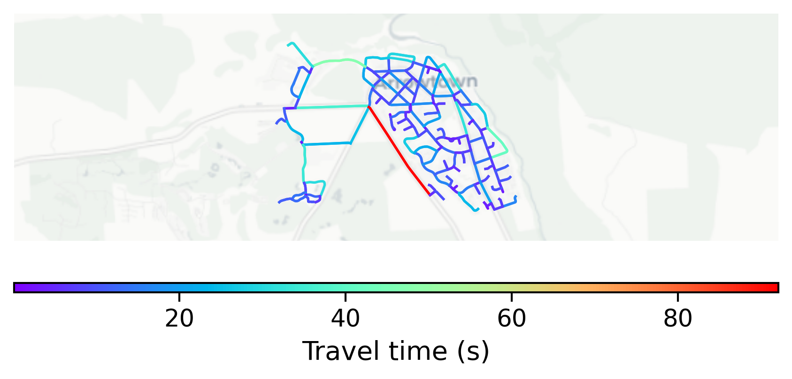

# Arrowtown, New Zealand

#### Location Information

- **City**: Arrowtown
- **Country**: New Zealand
- **Data Source**: OpenStreetMap

- **Analysis Date**: 2025-10-10

#### Road network topology

#### Network Characteristics

##### Basic Topology

- **Number of Nodes**: 142
- **Number of Edges**: 350
- **Network Density**: 0.017481
- **Average Node Degree**: 4.930
- **Standard Deviation of Node Degrees**: 1.901

##### Clustering Properties

- **Global Clustering Coefficient**: 0.045045
- **Average Local Clustering Coefficient**: 0.039308
- **Degree Assortativity Coefficient**: 0.037002

##### Spatial Metrics

- **Total Network Length (meters)**: 46479.13
- **Average Edge Length (meters)**: 132.80
- **Average Travel Time per Edge (seconds)**: 11.63

---
*Report generated on 2025-10-10 18:27:29*
