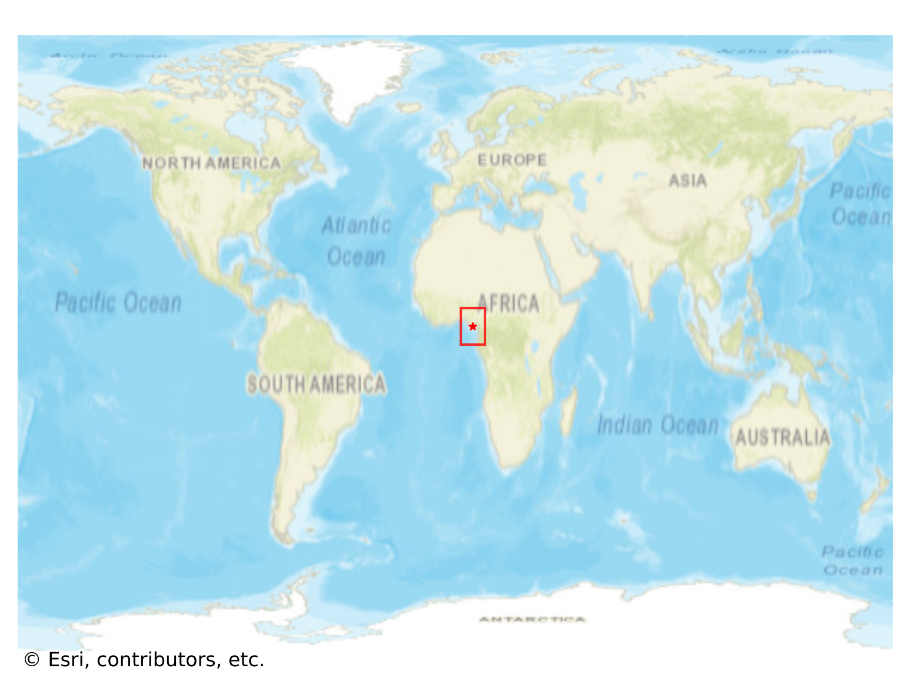

# Okrika, Nigeria

#### Location Information

- **City**: Okrika
- **Country**: Nigeria
- **Data Source**: OpenStreetMap

- **Analysis Date**: 2025-10-10

#### Road network topology

#### Network Characteristics

##### Basic Topology

- **Number of Nodes**: 297
- **Number of Edges**: 691
- **Network Density**: 0.007860
- **Average Node Degree**: 4.653
- **Standard Deviation of Node Degrees**: 1.996

##### Clustering Properties

- **Global Clustering Coefficient**: 0.081470
- **Average Local Clustering Coefficient**: 0.080929
- **Degree Assortativity Coefficient**: -0.185902

##### Spatial Metrics

- **Total Network Length (meters)**: 101083.96
- **Average Edge Length (meters)**: 146.29
- **Average Travel Time per Edge (seconds)**: 17.55

---
*Report generated on 2025-10-10 18:27:31*
