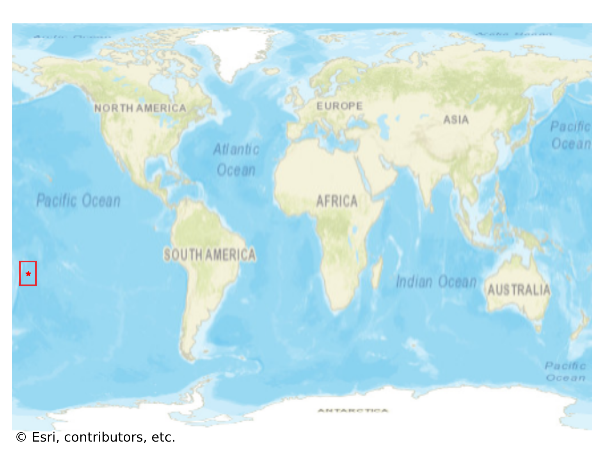
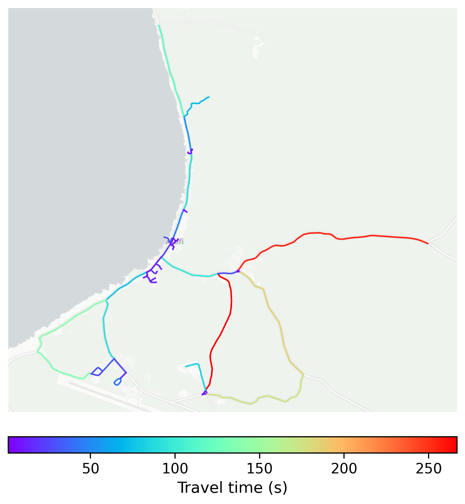

# Alofi, Niue

#### Location Information

- **City**: Alofi
- **Country**: Niue
- **Data Source**: OpenStreetMap

- **Analysis Date**: 2025-10-09

#### Road network topology

#### Network Characteristics

##### Basic Topology

- **Number of Nodes**: 45
- **Number of Edges**: 103
- **Network Density**: 0.052020
- **Average Node Degree**: 4.578
- **Standard Deviation of Node Degrees**: 1.856

##### Clustering Properties

- **Global Clustering Coefficient**: 0.076923
- **Average Local Clustering Coefficient**: 0.086207
- **Degree Assortativity Coefficient**: -0.276016

##### Spatial Metrics

- **Total Network Length (meters)**: 50683.68
- **Average Edge Length (meters)**: 492.07
- **Average Travel Time per Edge (seconds)**: 46.37

---
*Report generated on 2025-10-09 19:20:06*
