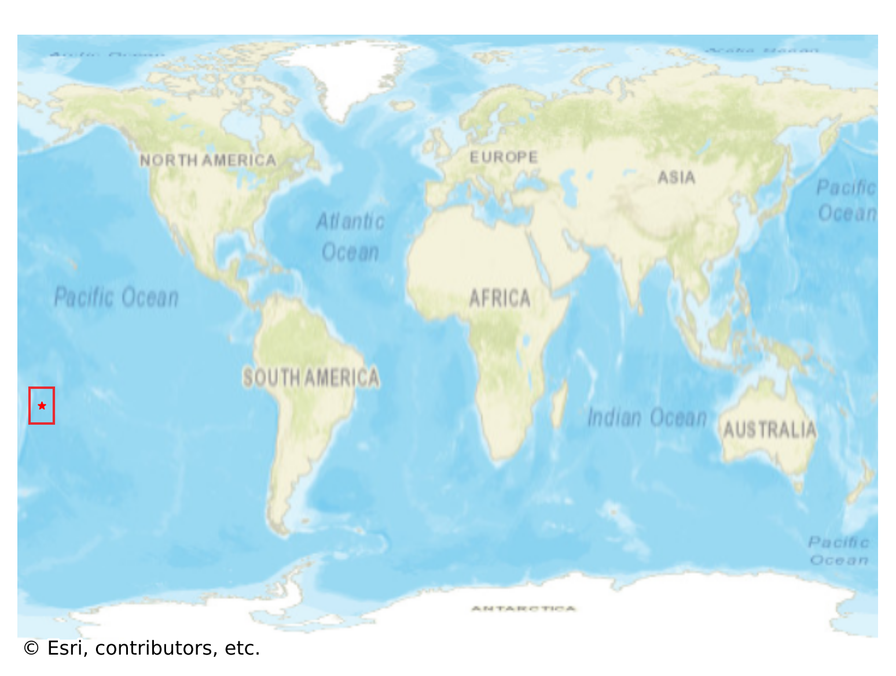
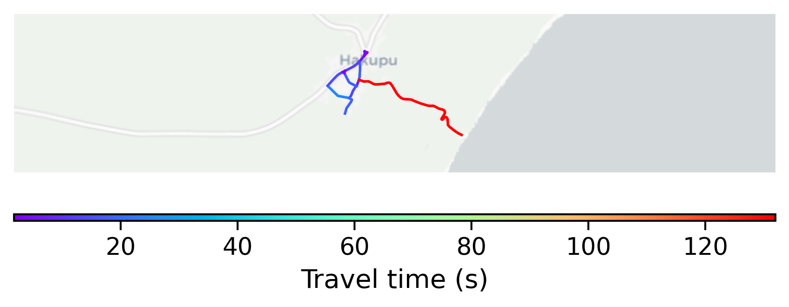

# Hakupu, Niue

#### Location Information

- **City**: Hakupu
- **Country**: Niue
- **Data Source**: OpenStreetMap

- **Analysis Date**: 2025-10-09

#### Road network topology

#### Network Characteristics

##### Basic Topology

- **Number of Nodes**: 13
- **Number of Edges**: 32
- **Network Density**: 0.205128
- **Average Node Degree**: 4.923
- **Standard Deviation of Node Degrees**: 1.492

##### Clustering Properties

- **Global Clustering Coefficient**: 0.222222
- **Average Local Clustering Coefficient**: 0.303030
- **Degree Assortativity Coefficient**: -0.103448

##### Spatial Metrics

- **Total Network Length (meters)**: 4868.12
- **Average Edge Length (meters)**: 152.13
- **Average Travel Time per Edge (seconds)**: 17.36

---
*Report generated on 2025-10-09 19:20:07*
