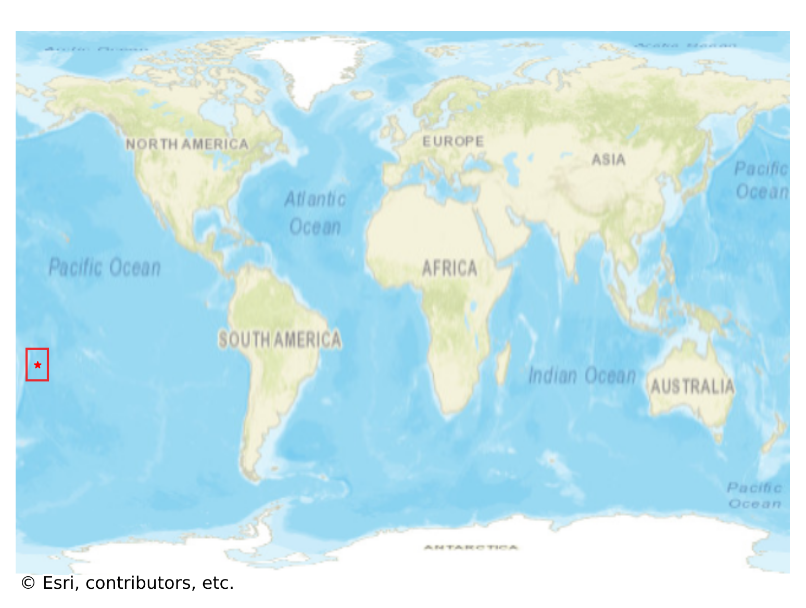

# Niue, Niue

#### Location Information

- **City**: Niue
- **Country**: Niue
- **Data Source**: OpenStreetMap

- **Analysis Date**: 2025-10-10

#### Road network topology

#### Network Characteristics

##### Basic Topology

- **Number of Nodes**: 117
- **Number of Edges**: 297
- **Network Density**: 0.021883
- **Average Node Degree**: 5.077
- **Standard Deviation of Node Degrees**: 1.817

##### Clustering Properties

- **Global Clustering Coefficient**: 0.125000
- **Average Local Clustering Coefficient**: 0.124031
- **Degree Assortativity Coefficient**: -0.131113

##### Spatial Metrics

- **Total Network Length (meters)**: 267635.92
- **Average Edge Length (meters)**: 901.13
- **Average Travel Time per Edge (seconds)**: 76.18

---
*Report generated on 2025-10-10 18:27:36*
