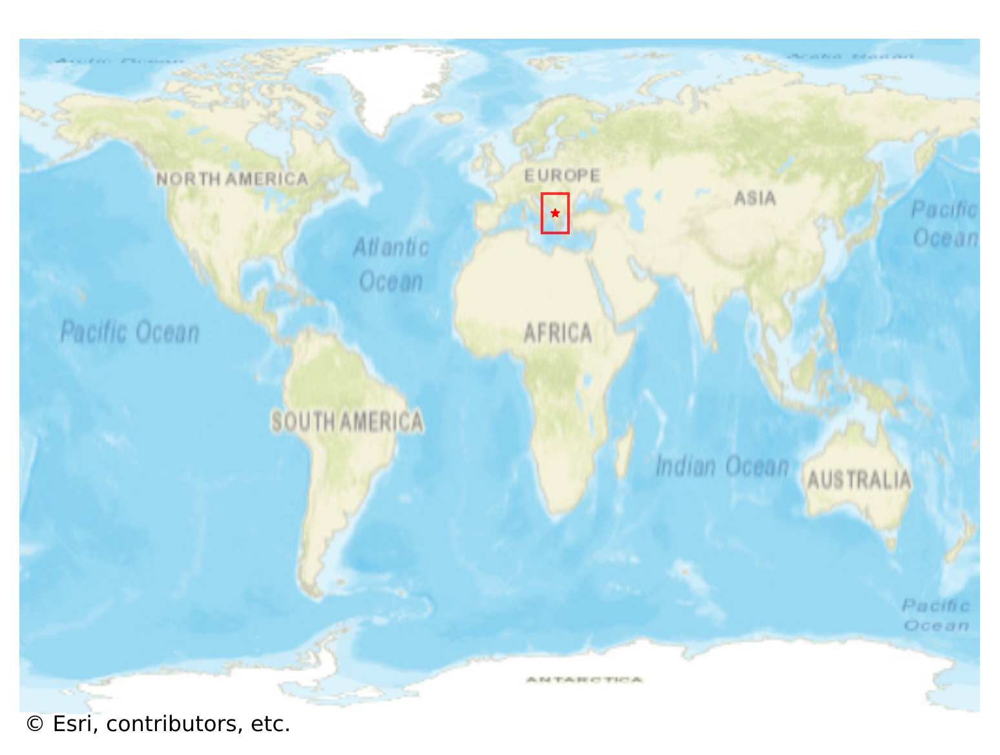
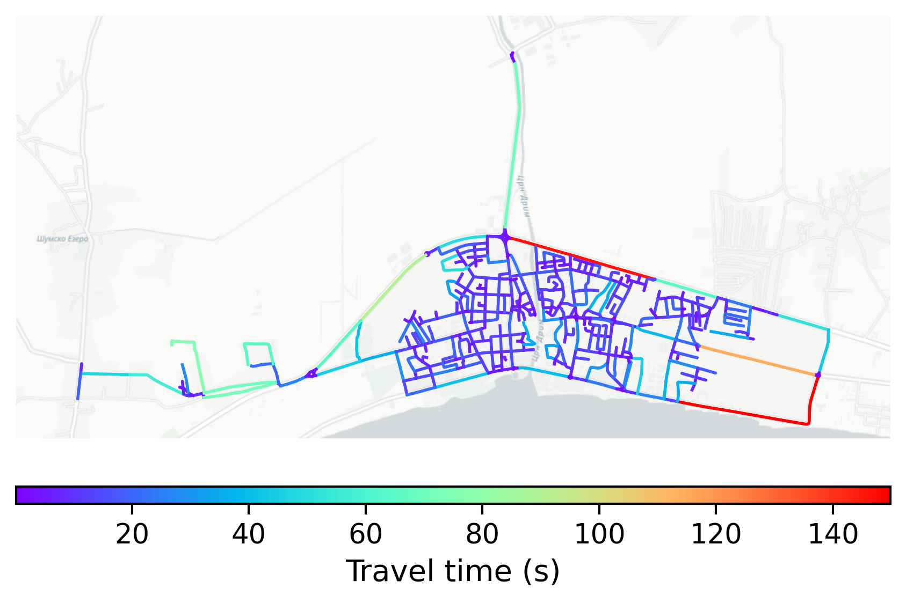

# Struga, North Macedonia

#### Location Information

- **City**: Struga
- **Country**: North Macedonia
- **Data Source**: OpenStreetMap

- **Analysis Date**: 2025-10-09

#### Road network topology

#### Network Characteristics

##### Basic Topology

- **Number of Nodes**: 432
- **Number of Edges**: 1,044
- **Network Density**: 0.005607
- **Average Node Degree**: 4.833
- **Standard Deviation of Node Degrees**: 1.959

##### Clustering Properties

- **Global Clustering Coefficient**: 0.081702
- **Average Local Clustering Coefficient**: 0.084320
- **Degree Assortativity Coefficient**: 0.098110

##### Spatial Metrics

- **Total Network Length (meters)**: 110904.60
- **Average Edge Length (meters)**: 106.23
- **Average Travel Time per Edge (seconds)**: 12.37

---
*Report generated on 2025-10-09 19:20:11*
