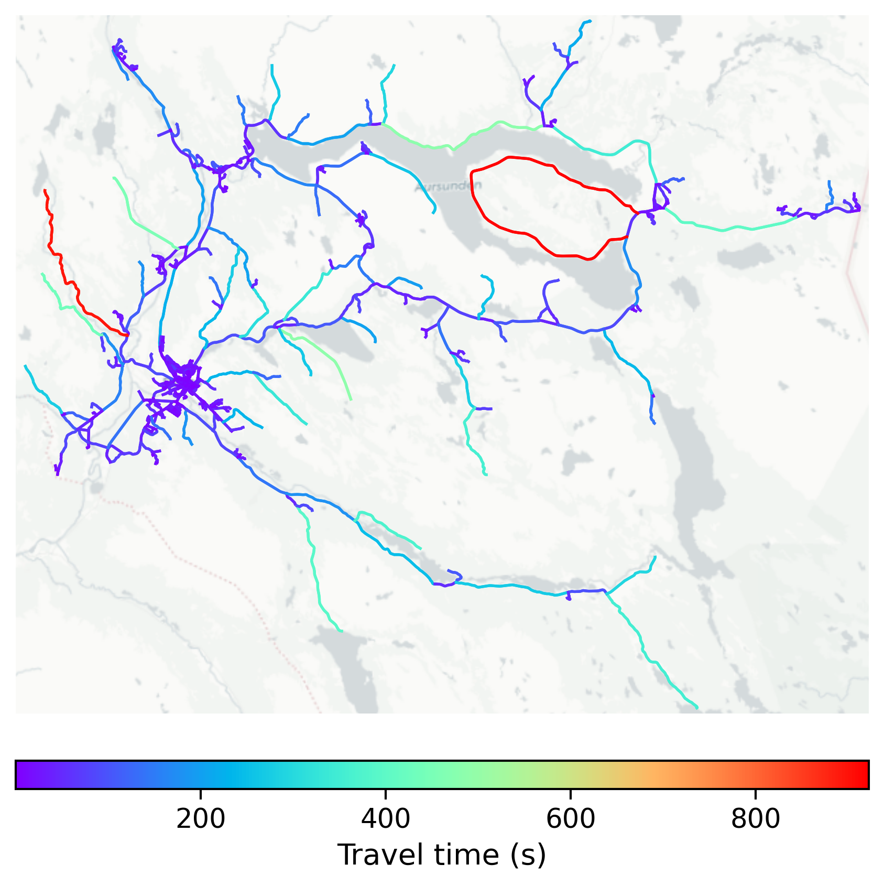

# Røros, Norway

#### Location Information

- **City**: Røros
- **Country**: Norway
- **Data Source**: OpenStreetMap

- **Analysis Date**: 2025-10-10

#### Road network topology

#### Network Characteristics

##### Basic Topology

- **Number of Nodes**: 627
- **Number of Edges**: 1,425
- **Network Density**: 0.003631
- **Average Node Degree**: 4.545
- **Standard Deviation of Node Degrees**: 1.950

##### Clustering Properties

- **Global Clustering Coefficient**: 0.072231
- **Average Local Clustering Coefficient**: 0.072127
- **Degree Assortativity Coefficient**: -0.124232

##### Spatial Metrics

- **Total Network Length (meters)**: 932150.40
- **Average Edge Length (meters)**: 654.14
- **Average Travel Time per Edge (seconds)**: 45.87

---
*Report generated on 2025-10-10 16:10:19*
