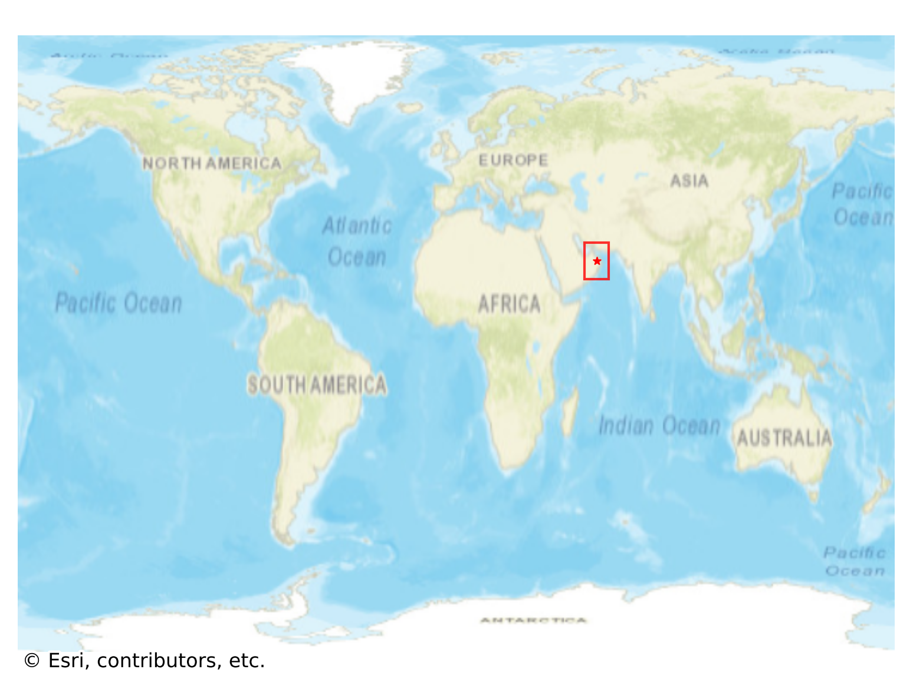
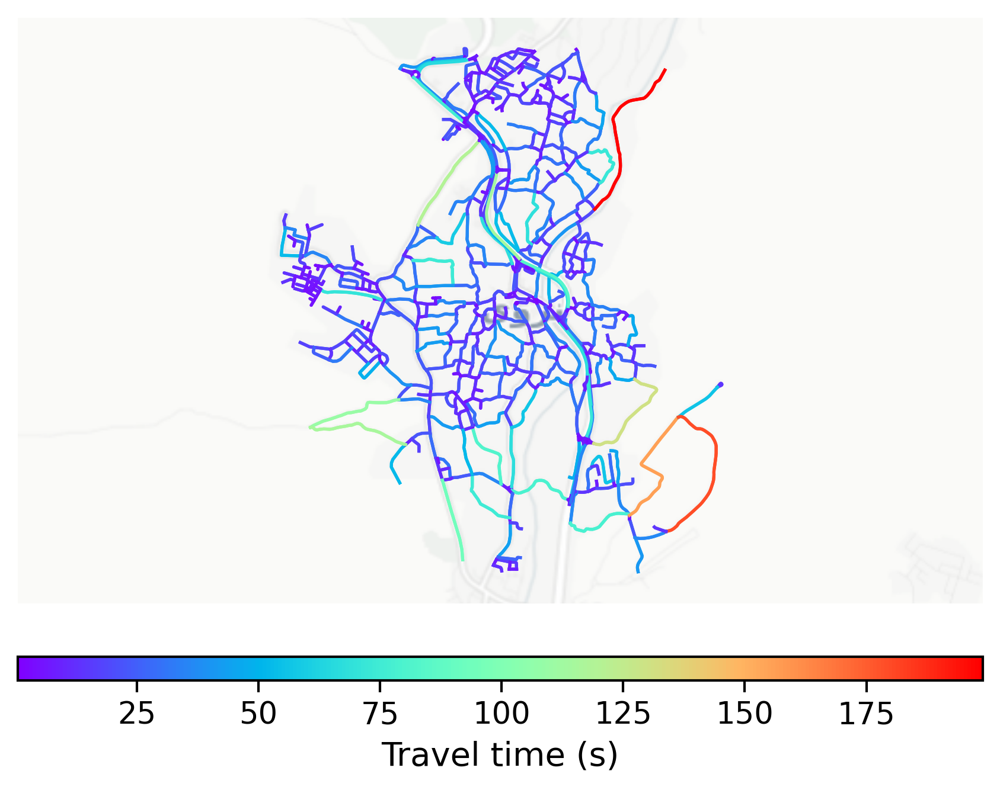

# Nizwa, Oman

#### Location Information

- **City**: Nizwa
- **Country**: Oman
- **Data Source**: OpenStreetMap

- **Analysis Date**: 2025-10-10

#### Road network topology

#### Network Characteristics

##### Basic Topology

- **Number of Nodes**: 583
- **Number of Edges**: 1,451
- **Network Density**: 0.004276
- **Average Node Degree**: 4.978
- **Standard Deviation of Node Degrees**: 1.702

##### Clustering Properties

- **Global Clustering Coefficient**: 0.089695
- **Average Local Clustering Coefficient**: 0.091734
- **Degree Assortativity Coefficient**: 0.190451

##### Spatial Metrics

- **Total Network Length (meters)**: 211841.68
- **Average Edge Length (meters)**: 146.00
- **Average Travel Time per Edge (seconds)**: 17.52

---
*Report generated on 2025-10-10 16:10:23*
