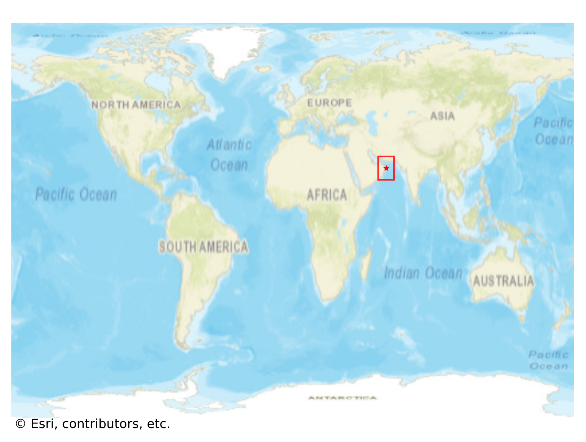
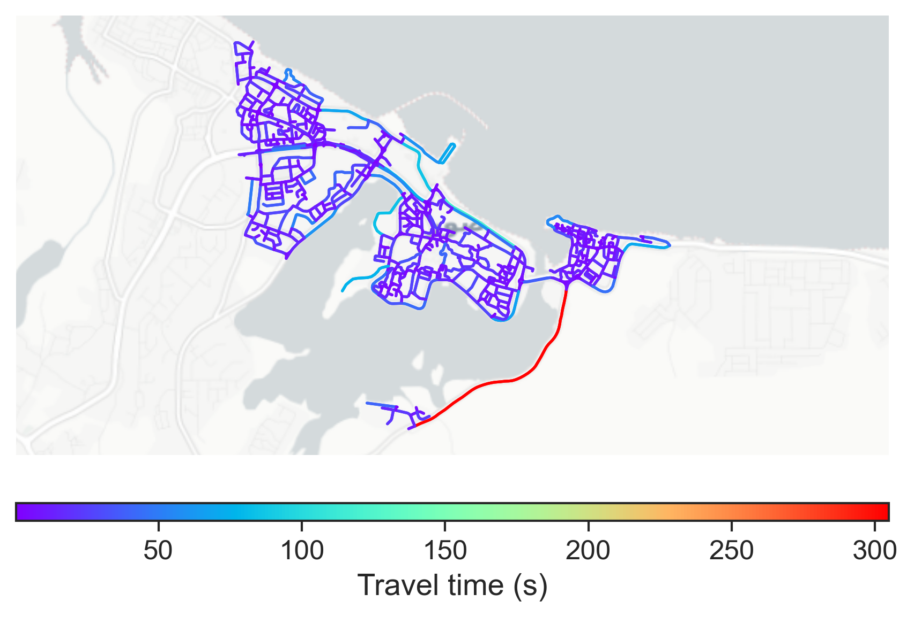

# Sur, Oman

#### Location Information

- **City**: Sur
- **Country**: Oman
- **Data Source**: OpenStreetMap

- **Analysis Date**: 2025-10-10

#### Road network topology

#### Network Characteristics

##### Basic Topology

- **Number of Nodes**: 756
- **Number of Edges**: 1,820
- **Network Density**: 0.003189
- **Average Node Degree**: 4.815
- **Standard Deviation of Node Degrees**: 1.671

##### Clustering Properties

- **Global Clustering Coefficient**: 0.132956
- **Average Local Clustering Coefficient**: 0.123861
- **Degree Assortativity Coefficient**: 0.257818

##### Spatial Metrics

- **Total Network Length (meters)**: 168882.83
- **Average Edge Length (meters)**: 92.79
- **Average Travel Time per Edge (seconds)**: 11.14

---
*Report generated on 2025-10-10 16:10:26*
