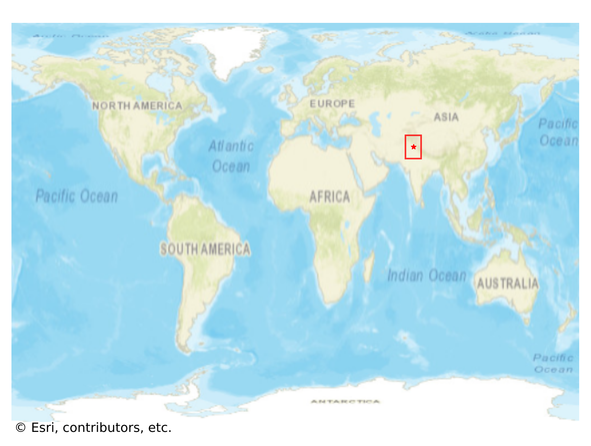
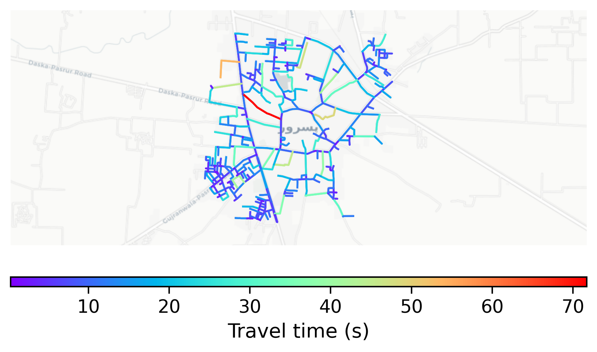

# Pasrur, Pakistan

#### Location Information

- **City**: Pasrur
- **Country**: Pakistan
- **Data Source**: OpenStreetMap

- **Analysis Date**: 2025-10-10

#### Road network topology

#### Network Characteristics

##### Basic Topology

- **Number of Nodes**: 367
- **Number of Edges**: 871
- **Network Density**: 0.006484
- **Average Node Degree**: 4.747
- **Standard Deviation of Node Degrees**: 2.019

##### Clustering Properties

- **Global Clustering Coefficient**: 0.037360
- **Average Local Clustering Coefficient**: 0.041995
- **Degree Assortativity Coefficient**: -0.064296

##### Spatial Metrics

- **Total Network Length (meters)**: 91907.57
- **Average Edge Length (meters)**: 105.52
- **Average Travel Time per Edge (seconds)**: 10.68

---
*Report generated on 2025-10-10 16:10:28*
