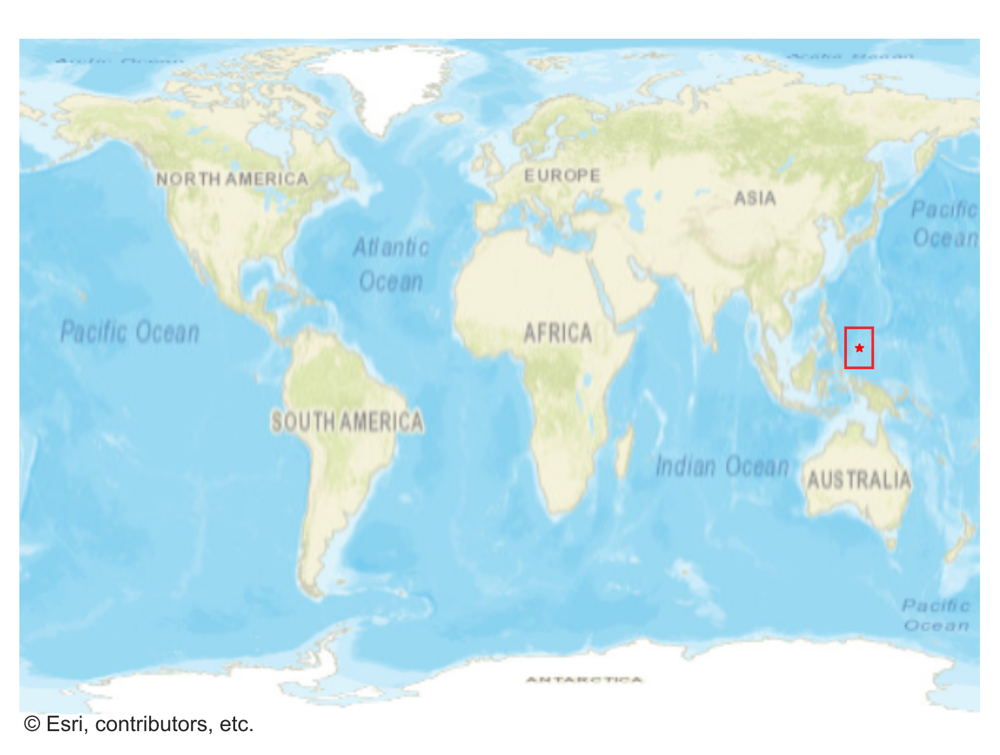
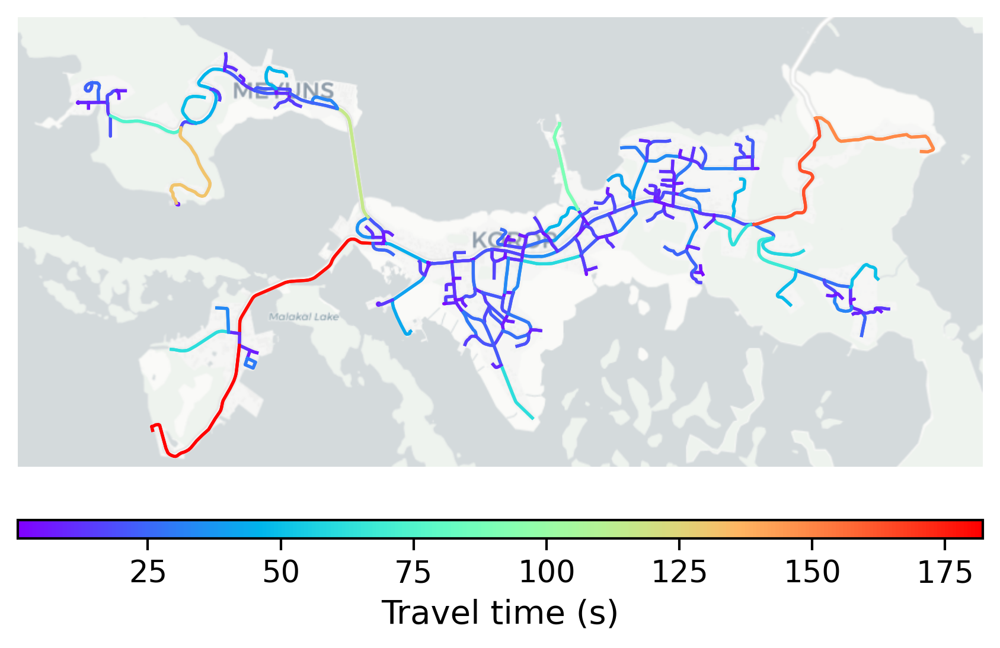

# Koror, Palau

#### Location Information

- **City**: Koror
- **Country**: Palau
- **Data Source**: OpenStreetMap

- **Analysis Date**: 2025-10-10

#### Road network topology

#### Network Characteristics

##### Basic Topology

- **Number of Nodes**: 238
- **Number of Edges**: 552
- **Network Density**: 0.009786
- **Average Node Degree**: 4.639
- **Standard Deviation of Node Degrees**: 2.016

##### Clustering Properties

- **Global Clustering Coefficient**: 0.049383
- **Average Local Clustering Coefficient**: 0.044743
- **Degree Assortativity Coefficient**: -0.105822

##### Spatial Metrics

- **Total Network Length (meters)**: 89933.34
- **Average Edge Length (meters)**: 162.92
- **Average Travel Time per Edge (seconds)**: 19.55

---
*Report generated on 2025-10-10 16:10:29*
