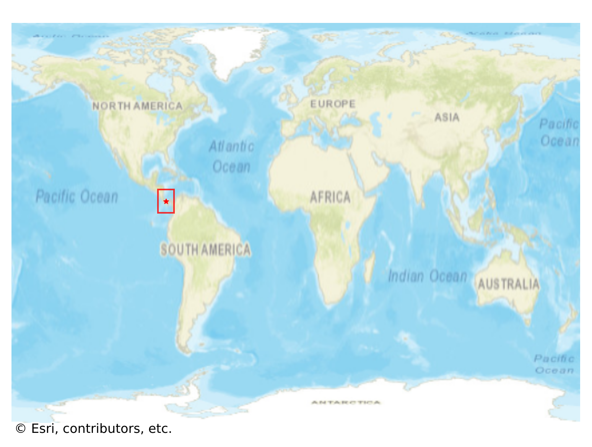
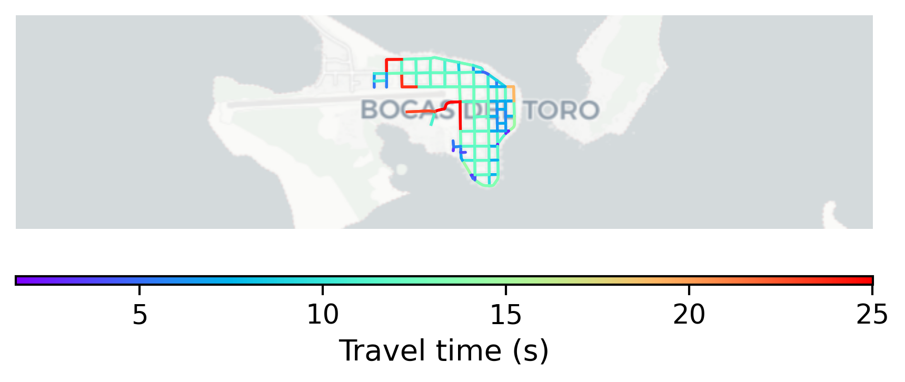

# Bocas_Town, Panama

#### Location Information

- **City**: Bocas_Town
- **Country**: Panama
- **Data Source**: OpenStreetMap

- **Analysis Date**: 2025-10-10

#### Road network topology

#### Network Characteristics

##### Basic Topology

- **Number of Nodes**: 74
- **Number of Edges**: 235
- **Network Density**: 0.043502
- **Average Node Degree**: 6.351
- **Standard Deviation of Node Degrees**: 1.743

##### Clustering Properties

- **Global Clustering Coefficient**: 0.083916
- **Average Local Clustering Coefficient**: 0.089552
- **Degree Assortativity Coefficient**: 0.253257

##### Spatial Metrics

- **Total Network Length (meters)**: 20054.69
- **Average Edge Length (meters)**: 85.34
- **Average Travel Time per Edge (seconds)**: 10.24

---
*Report generated on 2025-10-10 16:10:31*
