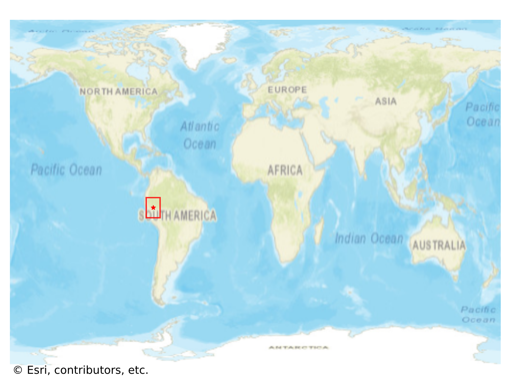
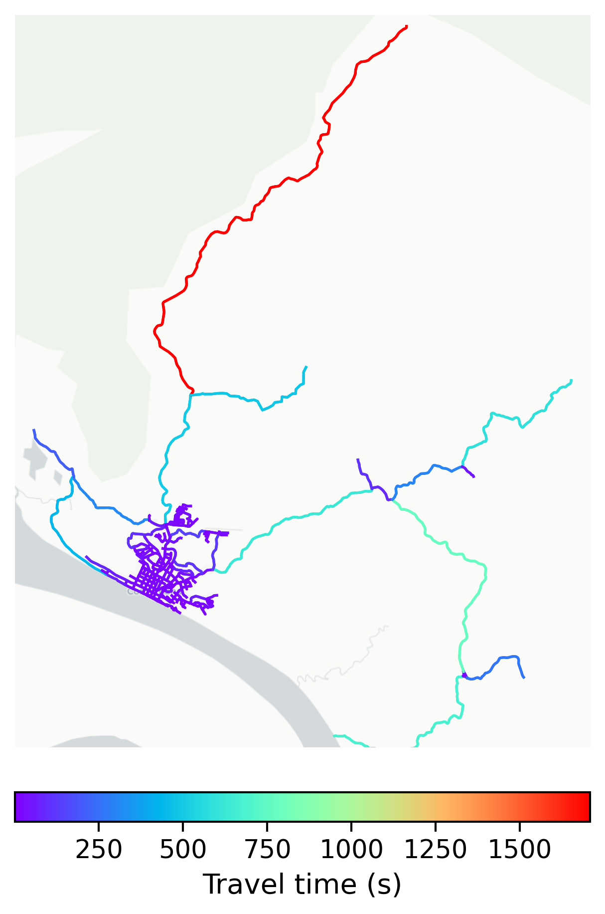

# Contamana, Peru

#### Location Information

- **City**: Contamana
- **Country**: Peru
- **Data Source**: OpenStreetMap

- **Analysis Date**: 2025-10-09

#### Road network topology

#### Network Characteristics

##### Basic Topology

- **Number of Nodes**: 252
- **Number of Edges**: 655
- **Network Density**: 0.010355
- **Average Node Degree**: 5.198
- **Standard Deviation of Node Degrees**: 2.032

##### Clustering Properties

- **Global Clustering Coefficient**: 0.050704
- **Average Local Clustering Coefficient**: 0.054688
- **Degree Assortativity Coefficient**: -0.040990

##### Spatial Metrics

- **Total Network Length (meters)**: 209512.51
- **Average Edge Length (meters)**: 319.87
- **Average Travel Time per Edge (seconds)**: 38.38

---
*Report generated on 2025-10-09 19:20:18*
