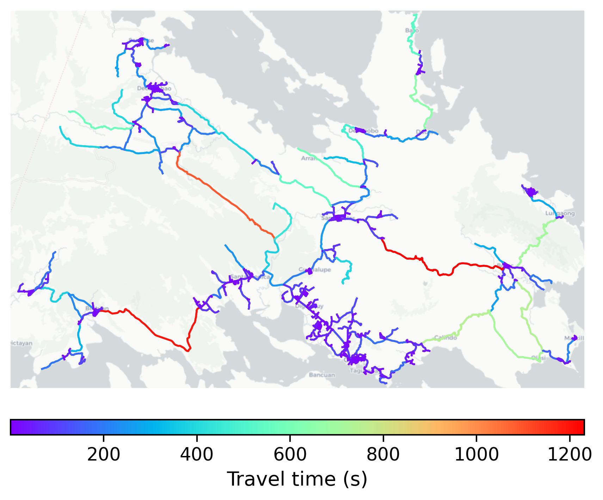

# Coron, Philippines

#### Location Information

- **City**: Coron
- **Country**: Philippines
- **Data Source**: OpenStreetMap

- **Analysis Date**: 2025-10-10

#### Road network topology

#### Network Characteristics

##### Basic Topology

- **Number of Nodes**: 692
- **Number of Edges**: 1,707
- **Network Density**: 0.003570
- **Average Node Degree**: 4.934
- **Standard Deviation of Node Degrees**: 2.055

##### Clustering Properties

- **Global Clustering Coefficient**: 0.071250
- **Average Local Clustering Coefficient**: 0.073222
- **Degree Assortativity Coefficient**: -0.030984

##### Spatial Metrics

- **Total Network Length (meters)**: 698382.29
- **Average Edge Length (meters)**: 409.13
- **Average Travel Time per Edge (seconds)**: 49.10

---
*Report generated on 2025-10-10 18:27:56*
