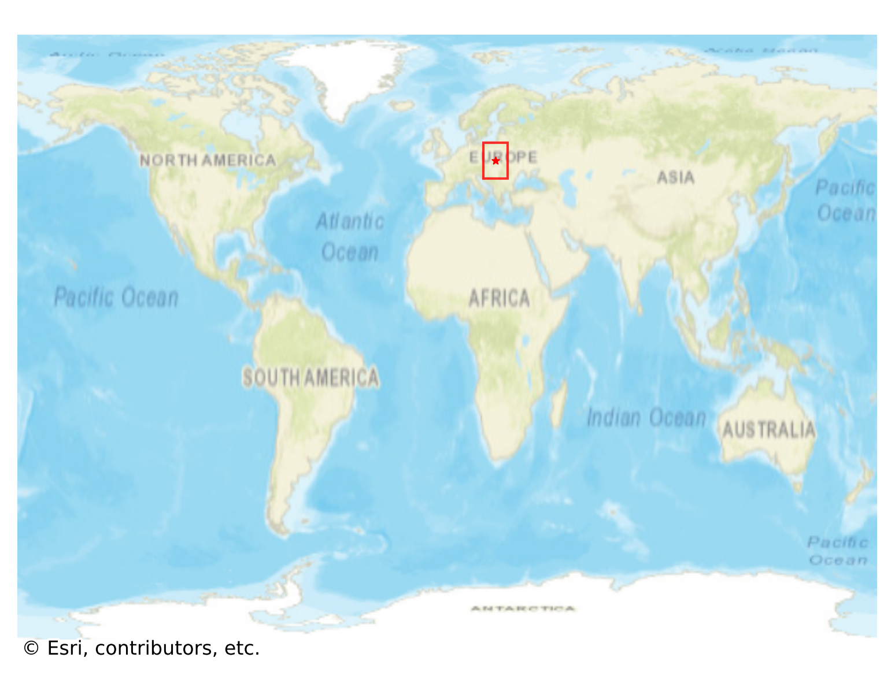
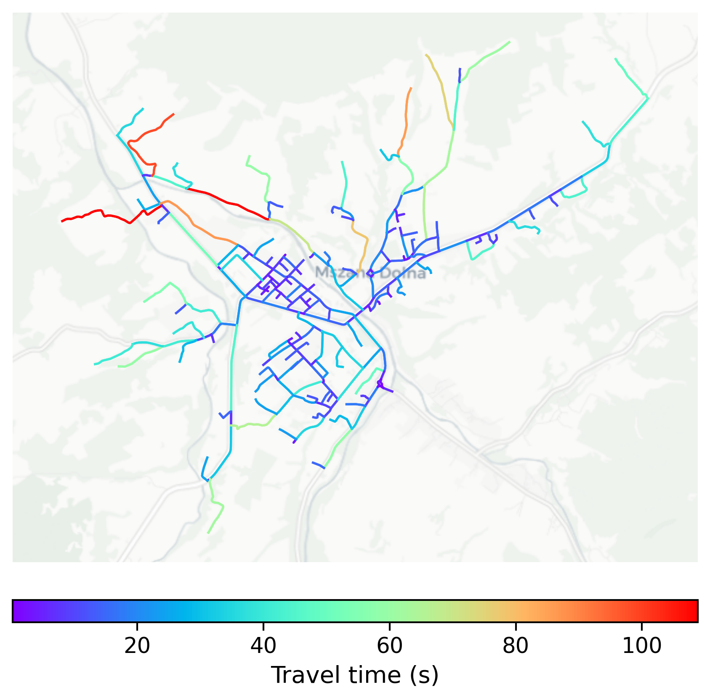

# Mszana_Dolna, Poland

#### Location Information

- **City**: Mszana_Dolna
- **Country**: Poland
- **Data Source**: OpenStreetMap

- **Analysis Date**: 2025-10-10

#### Road network topology

#### Network Characteristics

##### Basic Topology

- **Number of Nodes**: 238
- **Number of Edges**: 527
- **Network Density**: 0.009343
- **Average Node Degree**: 4.429
- **Standard Deviation of Node Degrees**: 1.962

##### Clustering Properties

- **Global Clustering Coefficient**: 0.038217
- **Average Local Clustering Coefficient**: 0.037879
- **Degree Assortativity Coefficient**: -0.113155

##### Spatial Metrics

- **Total Network Length (meters)**: 109680.18
- **Average Edge Length (meters)**: 208.12
- **Average Travel Time per Edge (seconds)**: 19.76

---
*Report generated on 2025-10-10 18:27:58*
