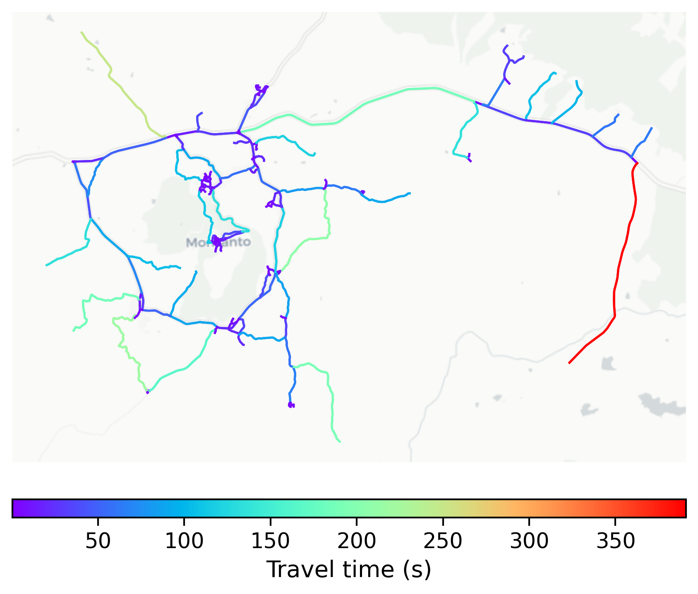

# Monsanto, Portugal

#### Location Information

- **City**: Monsanto
- **Country**: Portugal
- **Data Source**: OpenStreetMap

- **Analysis Date**: 2025-10-09

#### Road network topology

#### Network Characteristics

##### Basic Topology

- **Number of Nodes**: 167
- **Number of Edges**: 394
- **Network Density**: 0.014213
- **Average Node Degree**: 4.719
- **Standard Deviation of Node Degrees**: 1.892

##### Clustering Properties

- **Global Clustering Coefficient**: 0.099174
- **Average Local Clustering Coefficient**: 0.105932
- **Degree Assortativity Coefficient**: -0.104941

##### Spatial Metrics

- **Total Network Length (meters)**: 116032.24
- **Average Edge Length (meters)**: 294.50
- **Average Travel Time per Edge (seconds)**: 31.76

---
*Report generated on 2025-10-09 19:20:25*
