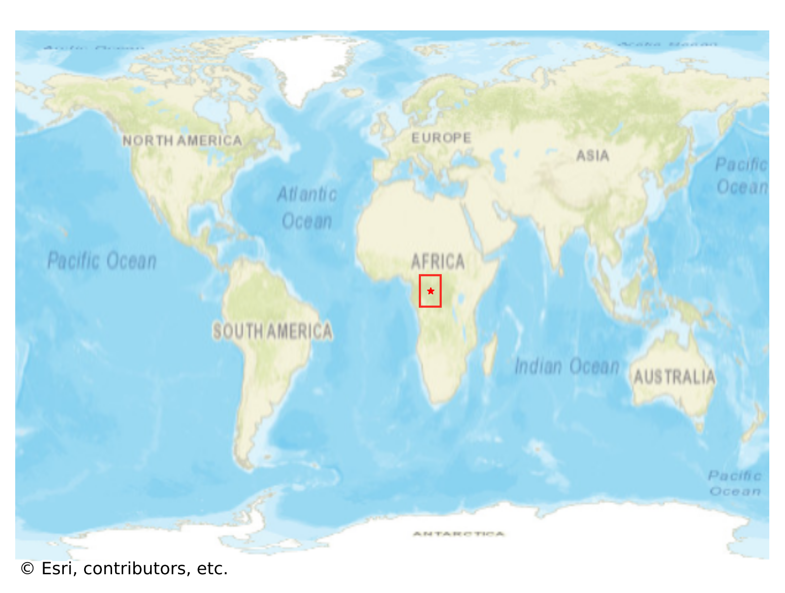
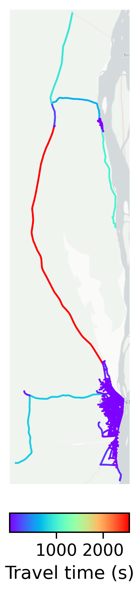

# Impfondo, Republic of the Congo

#### Location Information

- **City**: Impfondo
- **Country**: Republic of the Congo
- **Data Source**: OpenStreetMap

- **Analysis Date**: 2025-10-09

#### Road network topology

#### Network Characteristics

##### Basic Topology

- **Number of Nodes**: 776
- **Number of Edges**: 2,360
- **Network Density**: 0.003924
- **Average Node Degree**: 6.082
- **Standard Deviation of Node Degrees**: 1.760

##### Clustering Properties

- **Global Clustering Coefficient**: 0.021731
- **Average Local Clustering Coefficient**: 0.024638
- **Degree Assortativity Coefficient**: 0.222881

##### Spatial Metrics

- **Total Network Length (meters)**: 361383.60
- **Average Edge Length (meters)**: 153.13
- **Average Travel Time per Edge (seconds)**: 18.38

---
*Report generated on 2025-10-09 19:20:29*
