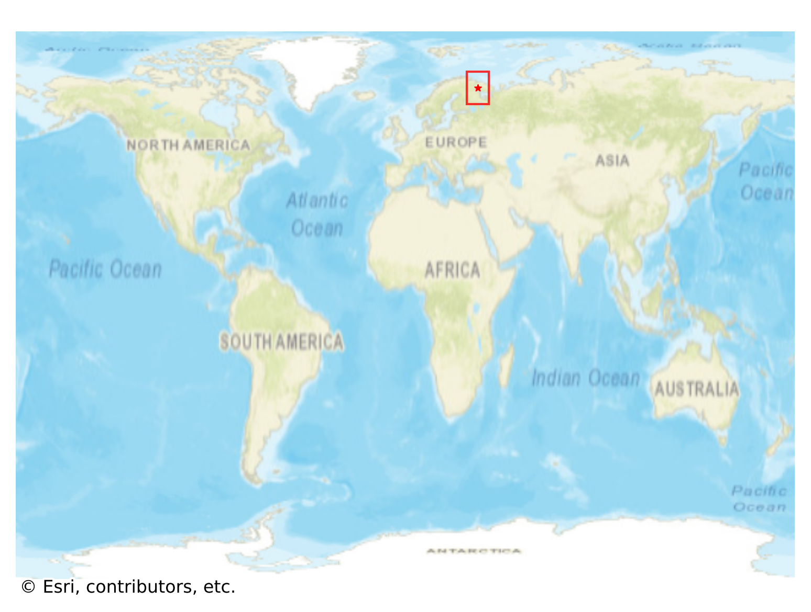
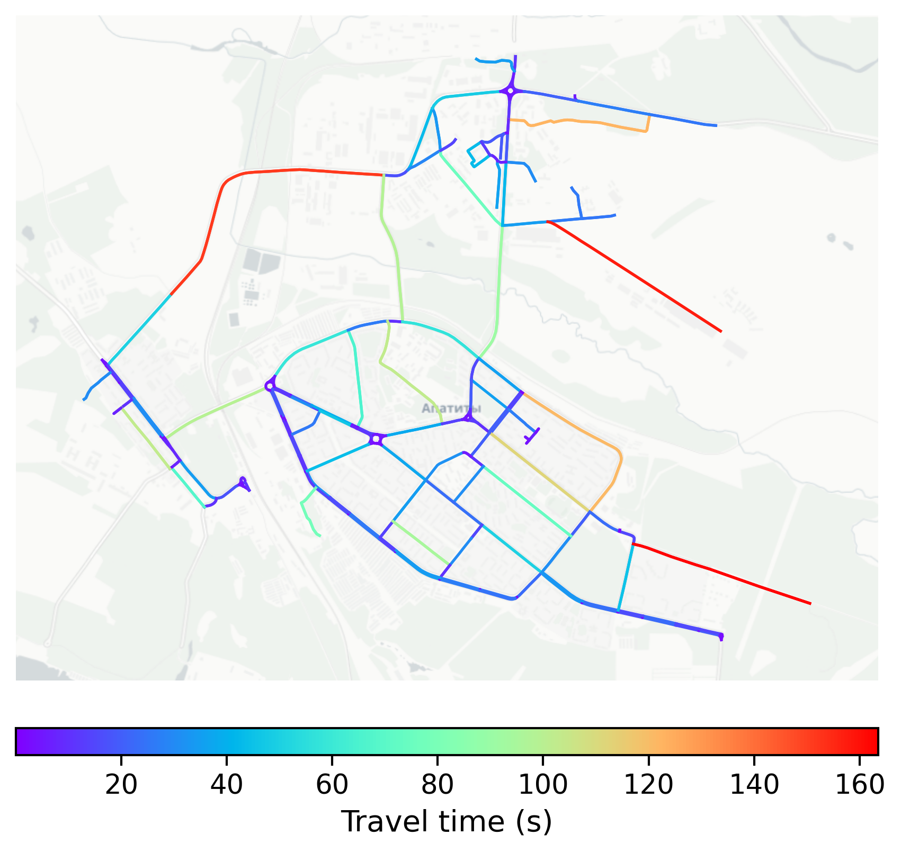

# Apatity, Russia

#### Location Information

- **City**: Apatity
- **Country**: Russia
- **Data Source**: OpenStreetMap

- **Analysis Date**: 2025-10-10

#### Road network topology

#### Network Characteristics

##### Basic Topology

- **Number of Nodes**: 176
- **Number of Edges**: 373
- **Network Density**: 0.012110
- **Average Node Degree**: 4.239
- **Standard Deviation of Node Degrees**: 1.508

##### Clustering Properties

- **Global Clustering Coefficient**: 0.108365
- **Average Local Clustering Coefficient**: 0.115924
- **Degree Assortativity Coefficient**: 0.247046

##### Spatial Metrics

- **Total Network Length (meters)**: 86155.52
- **Average Edge Length (meters)**: 230.98
- **Average Travel Time per Edge (seconds)**: 22.85

---
*Report generated on 2025-10-10 16:10:49*
