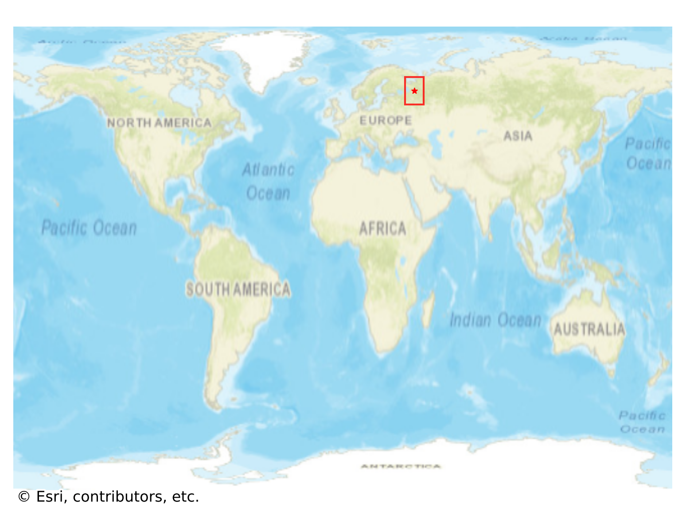
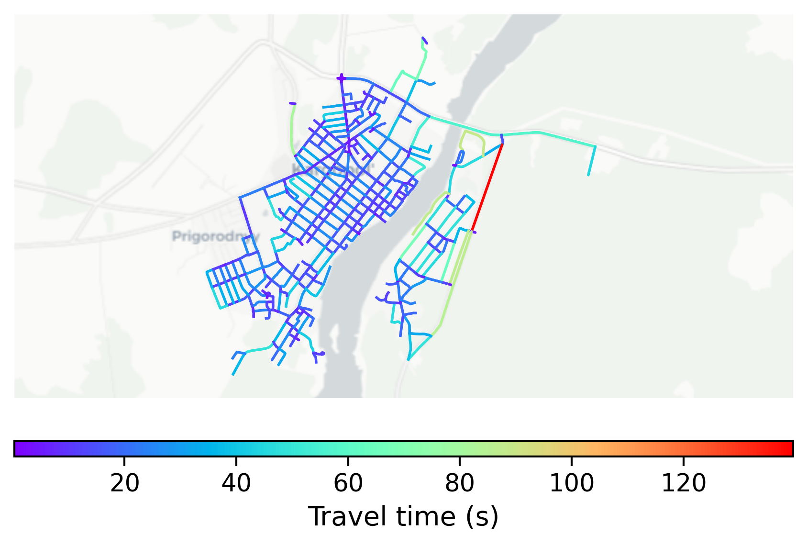

# Kargopol, Russia

#### Location Information

- **City**: Kargopol
- **Country**: Russia
- **Data Source**: OpenStreetMap

- **Analysis Date**: 2025-10-09

#### Road network topology

#### Network Characteristics

##### Basic Topology

- **Number of Nodes**: 338
- **Number of Edges**: 967
- **Network Density**: 0.008489
- **Average Node Degree**: 5.722
- **Standard Deviation of Node Degrees**: 2.041

##### Clustering Properties

- **Global Clustering Coefficient**: 0.052055
- **Average Local Clustering Coefficient**: 0.060552
- **Degree Assortativity Coefficient**: 0.165646

##### Spatial Metrics

- **Total Network Length (meters)**: 158659.48
- **Average Edge Length (meters)**: 164.07
- **Average Travel Time per Edge (seconds)**: 18.92

---
*Report generated on 2025-10-09 19:20:34*
