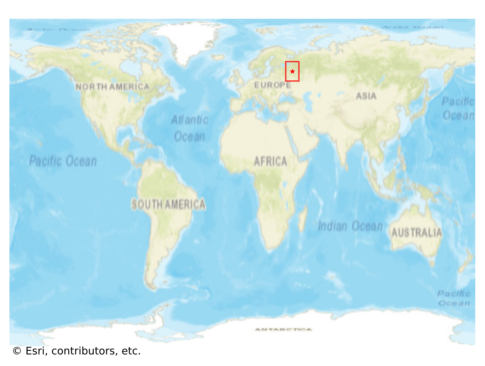
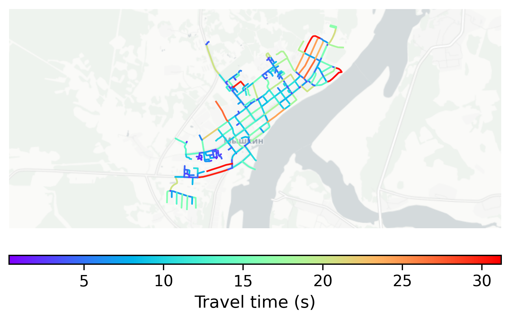

# Myshkin, Russia

#### Location Information

- **City**: Myshkin
- **Country**: Russia
- **Data Source**: OpenStreetMap

- **Analysis Date**: 2025-10-10

#### Road network topology

#### Network Characteristics

##### Basic Topology

- **Number of Nodes**: 225
- **Number of Edges**: 575
- **Network Density**: 0.011409
- **Average Node Degree**: 5.111
- **Standard Deviation of Node Degrees**: 2.022

##### Clustering Properties

- **Global Clustering Coefficient**: 0.069519
- **Average Local Clustering Coefficient**: 0.068687
- **Degree Assortativity Coefficient**: -0.002424

##### Spatial Metrics

- **Total Network Length (meters)**: 64920.30
- **Average Edge Length (meters)**: 112.90
- **Average Travel Time per Edge (seconds)**: 8.56

---
*Report generated on 2025-10-10 16:10:55*
