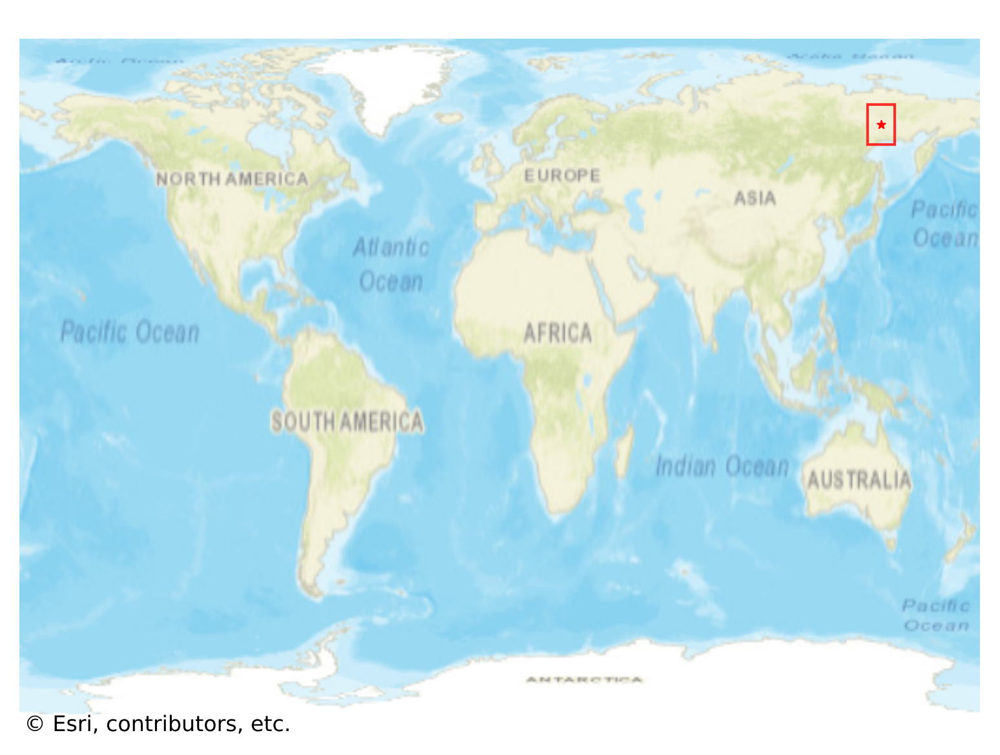
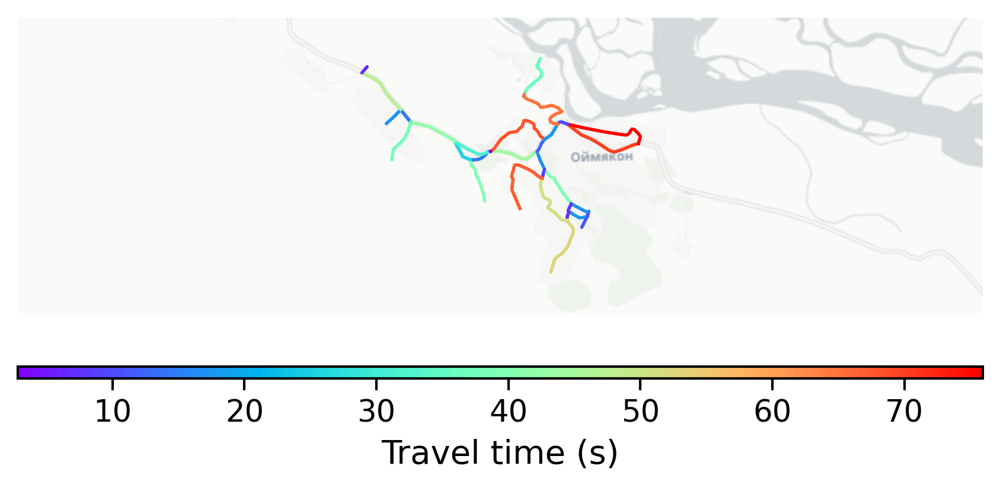

# Oymyakon, Russia

#### Location Information

- **City**: Oymyakon
- **Country**: Russia
- **Data Source**: OpenStreetMap

- **Analysis Date**: 2025-10-09

#### Road network topology

#### Network Characteristics

##### Basic Topology

- **Number of Nodes**: 28
- **Number of Edges**: 64
- **Network Density**: 0.084656
- **Average Node Degree**: 4.571
- **Standard Deviation of Node Degrees**: 1.761

##### Clustering Properties

- **Global Clustering Coefficient**: 0.122449
- **Average Local Clustering Coefficient**: 0.105263
- **Degree Assortativity Coefficient**: -0.032258

##### Spatial Metrics

- **Total Network Length (meters)**: 16322.34
- **Average Edge Length (meters)**: 255.04
- **Average Travel Time per Edge (seconds)**: 30.60

---
*Report generated on 2025-10-09 19:20:37*
