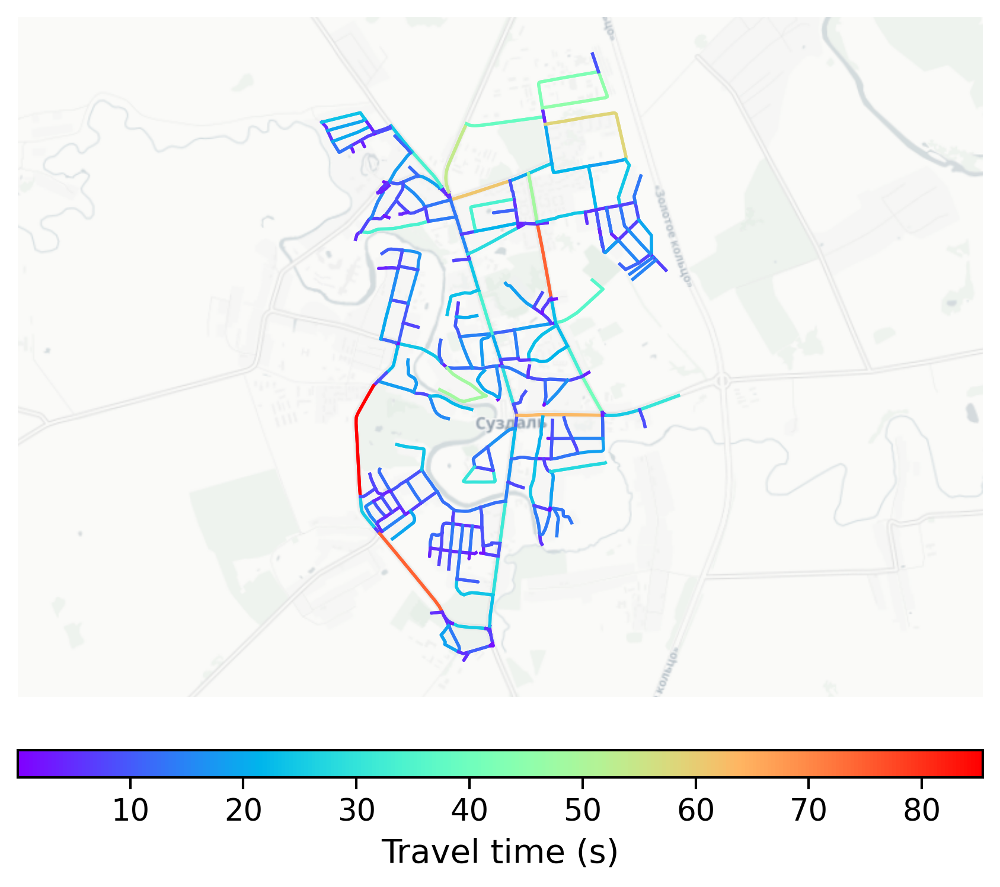

# Suzdal, Russia

#### Location Information

- **City**: Suzdal
- **Country**: Russia
- **Data Source**: OpenStreetMap

- **Analysis Date**: 2025-10-09

#### Road network topology

#### Network Characteristics

##### Basic Topology

- **Number of Nodes**: 270
- **Number of Edges**: 694
- **Network Density**: 0.009555
- **Average Node Degree**: 5.141
- **Standard Deviation of Node Degrees**: 2.093

##### Clustering Properties

- **Global Clustering Coefficient**: 0.101382
- **Average Local Clustering Coefficient**: 0.112667
- **Degree Assortativity Coefficient**: 0.112654

##### Spatial Metrics

- **Total Network Length (meters)**: 121081.84
- **Average Edge Length (meters)**: 174.47
- **Average Travel Time per Edge (seconds)**: 11.95

---
*Report generated on 2025-10-09 19:20:40*
