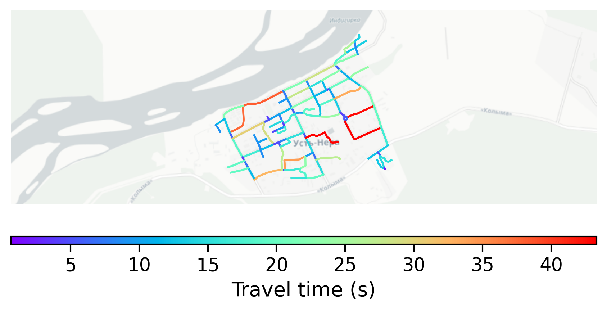

# UstNera, Russia

#### Location Information

- **City**: UstNera
- **Country**: Russia
- **Data Source**: OpenStreetMap

- **Analysis Date**: 2025-10-09

#### Road network topology

#### Network Characteristics

##### Basic Topology

- **Number of Nodes**: 86
- **Number of Edges**: 220
- **Network Density**: 0.030096
- **Average Node Degree**: 5.116
- **Standard Deviation of Node Degrees**: 1.943

##### Clustering Properties

- **Global Clustering Coefficient**: 0.072115
- **Average Local Clustering Coefficient**: 0.074359
- **Degree Assortativity Coefficient**: -0.024555

##### Spatial Metrics

- **Total Network Length (meters)**: 39168.74
- **Average Edge Length (meters)**: 178.04
- **Average Travel Time per Edge (seconds)**: 15.03

---
*Report generated on 2025-10-09 19:20:41*
