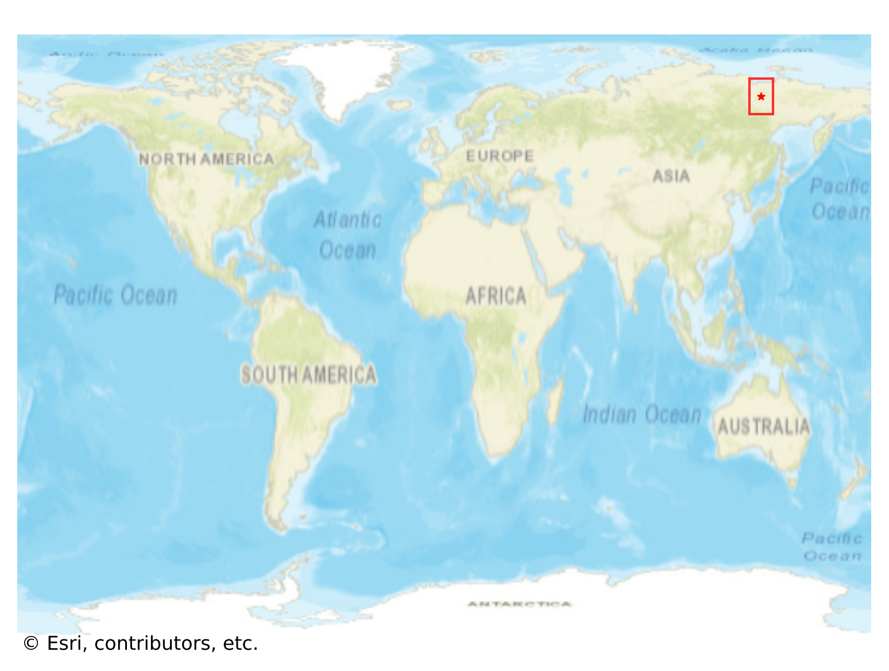
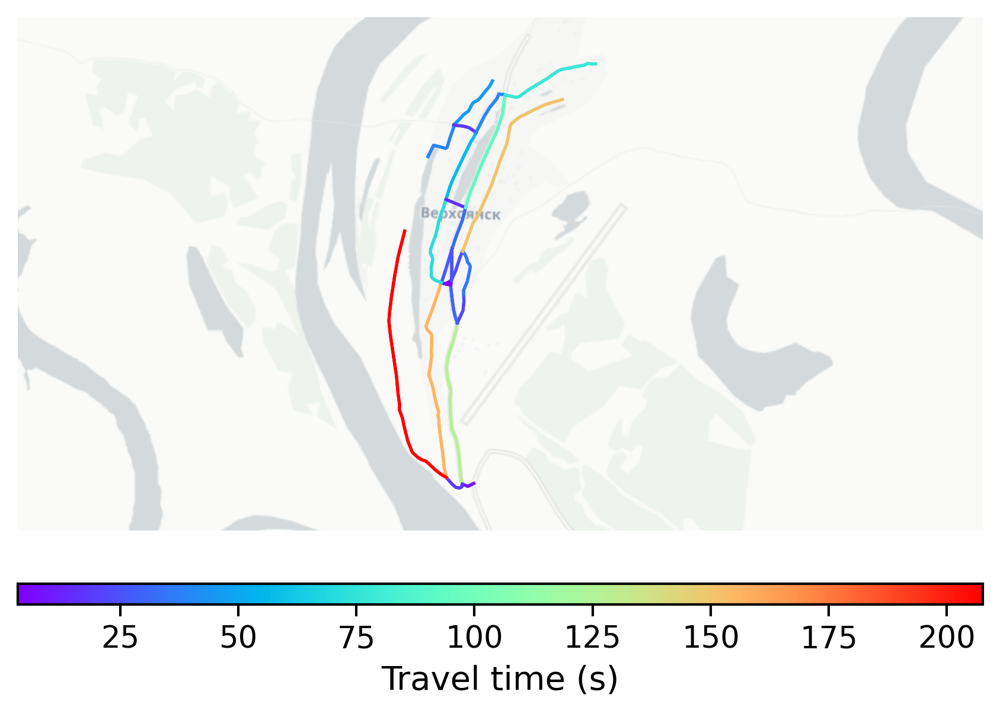

# Verkhoyansk, Russia

#### Location Information

- **City**: Verkhoyansk
- **Country**: Russia
- **Data Source**: OpenStreetMap

- **Analysis Date**: 2025-10-10

#### Road network topology

#### Network Characteristics

##### Basic Topology

- **Number of Nodes**: 21
- **Number of Edges**: 52
- **Network Density**: 0.123810
- **Average Node Degree**: 4.952
- **Standard Deviation of Node Degrees**: 2.011

##### Clustering Properties

- **Global Clustering Coefficient**: 0.061224
- **Average Local Clustering Coefficient**: 0.055556
- **Degree Assortativity Coefficient**: -0.020785

##### Spatial Metrics

- **Total Network Length (meters)**: 22358.56
- **Average Edge Length (meters)**: 429.97
- **Average Travel Time per Edge (seconds)**: 51.60

---
*Report generated on 2025-10-10 16:11:02*
