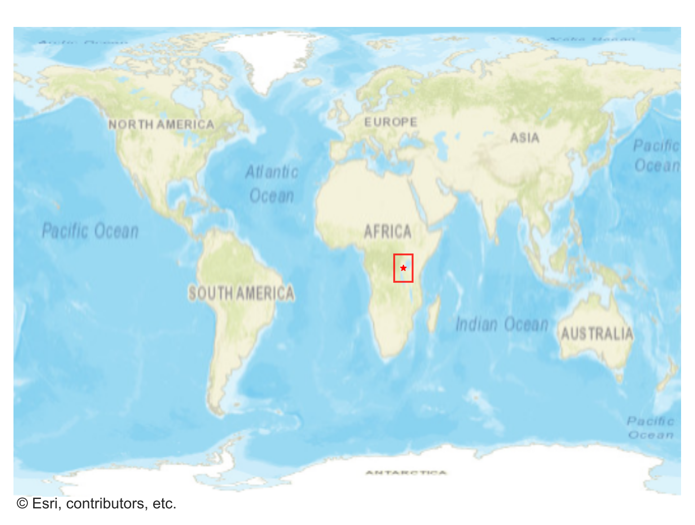
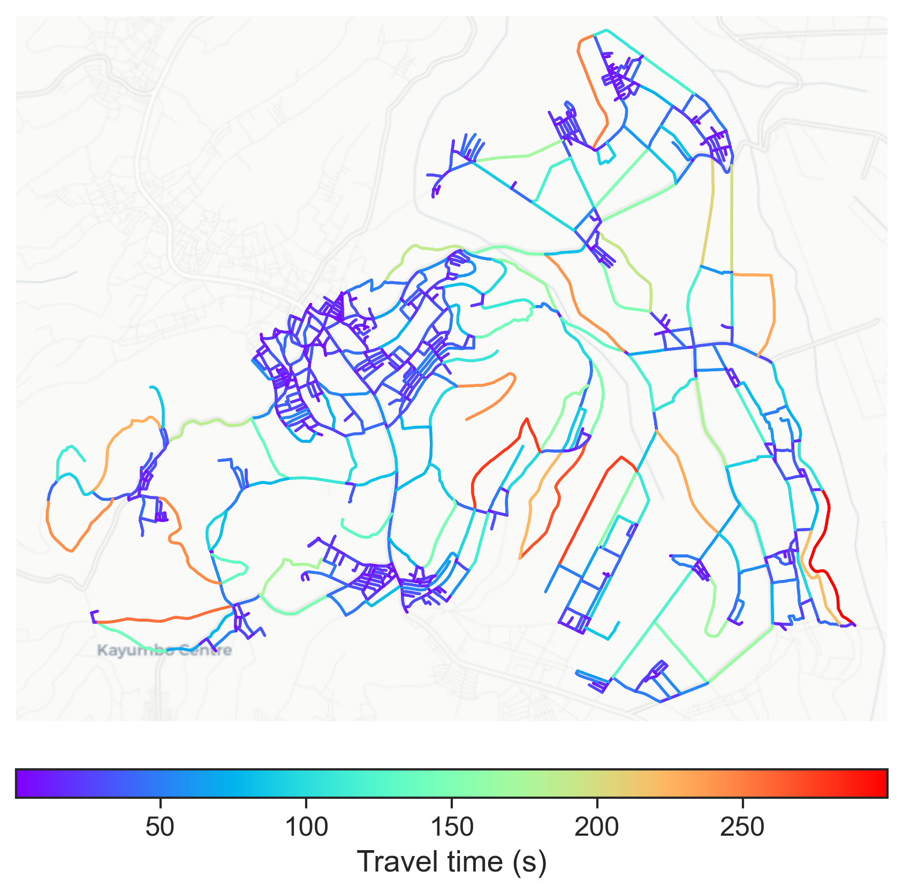

# Nyamata, Rwanda

#### Location Information

- **City**: Nyamata
- **Country**: Rwanda
- **Data Source**: OpenStreetMap

- **Analysis Date**: 2025-10-10

#### Road network topology

#### Network Characteristics

##### Basic Topology

- **Number of Nodes**: 792
- **Number of Edges**: 2,154
- **Network Density**: 0.003438
- **Average Node Degree**: 5.439
- **Standard Deviation of Node Degrees**: 1.675

##### Clustering Properties

- **Global Clustering Coefficient**: 0.043951
- **Average Local Clustering Coefficient**: 0.041730
- **Degree Assortativity Coefficient**: 0.015089

##### Spatial Metrics

- **Total Network Length (meters)**: 557273.08
- **Average Edge Length (meters)**: 258.72
- **Average Travel Time per Edge (seconds)**: 31.05

---
*Report generated on 2025-10-10 16:11:05*
