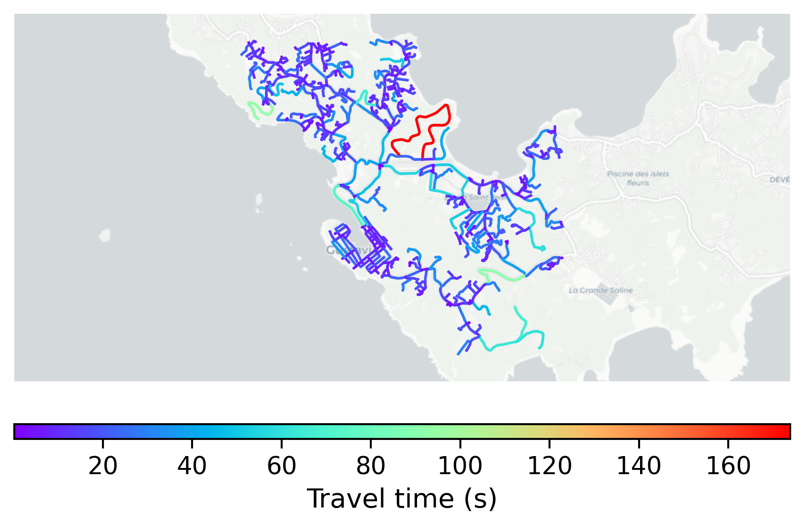

# Gustavia, Saint Barthelemy

#### Location Information

- **City**: Gustavia
- **Country**: Saint Barthelemy
- **Data Source**: OpenStreetMap

- **Analysis Date**: 2025-10-10

#### Road network topology

#### Network Characteristics

##### Basic Topology

- **Number of Nodes**: 602
- **Number of Edges**: 1,222
- **Network Density**: 0.003378
- **Average Node Degree**: 4.060
- **Standard Deviation of Node Degrees**: 1.942

##### Clustering Properties

- **Global Clustering Coefficient**: 0.043400
- **Average Local Clustering Coefficient**: 0.038793
- **Degree Assortativity Coefficient**: -0.273982

##### Spatial Metrics

- **Total Network Length (meters)**: 122327.79
- **Average Edge Length (meters)**: 100.10
- **Average Travel Time per Edge (seconds)**: 13.95

---
*Report generated on 2025-10-10 18:28:28*
