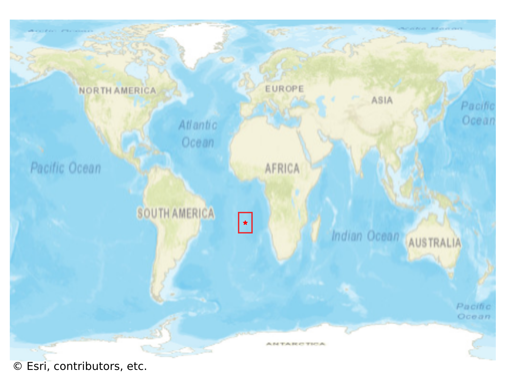

# Jamestown, Saint Helena

#### Location Information

- **City**: Jamestown
- **Country**: Saint Helena
- **Data Source**: OpenStreetMap

- **Analysis Date**: 2025-10-10

#### Road network topology

#### Network Characteristics

##### Basic Topology

- **Number of Nodes**: 15
- **Number of Edges**: 34
- **Network Density**: 0.161905
- **Average Node Degree**: 4.533
- **Standard Deviation of Node Degrees**: 1.857

##### Clustering Properties

- **Global Clustering Coefficient**: 0.090909
- **Average Local Clustering Coefficient**: 0.107143
- **Degree Assortativity Coefficient**: 0.326733

##### Spatial Metrics

- **Total Network Length (meters)**: 4627.61
- **Average Edge Length (meters)**: 136.11
- **Average Travel Time per Edge (seconds)**: 16.33

---
*Report generated on 2025-10-10 18:28:29*
