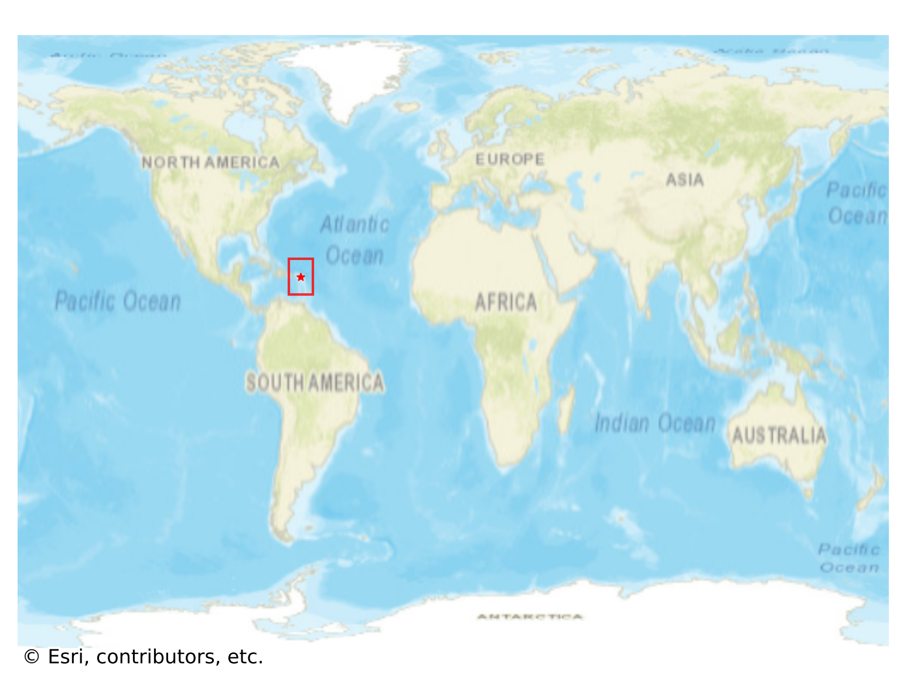
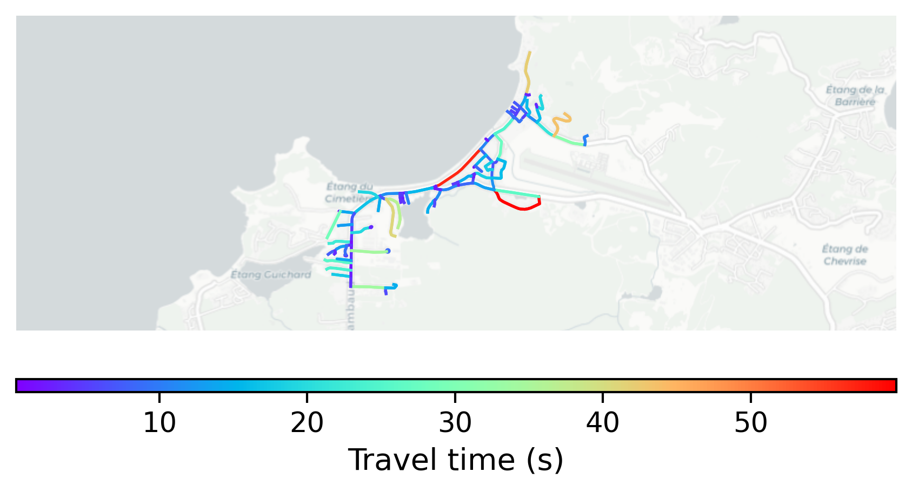

# Grand_Case, Saint Martin

#### Location Information

- **City**: Grand_Case
- **Country**: Saint Martin
- **Data Source**: OpenStreetMap

- **Analysis Date**: 2025-10-10

#### Road network topology

#### Network Characteristics

##### Basic Topology

- **Number of Nodes**: 103
- **Number of Edges**: 212
- **Network Density**: 0.020179
- **Average Node Degree**: 4.117
- **Standard Deviation of Node Degrees**: 1.861

##### Clustering Properties

- **Global Clustering Coefficient**: 0.050847
- **Average Local Clustering Coefficient**: 0.050847
- **Degree Assortativity Coefficient**: -0.209657

##### Spatial Metrics

- **Total Network Length (meters)**: 22543.14
- **Average Edge Length (meters)**: 106.34
- **Average Travel Time per Edge (seconds)**: 11.69

---
*Report generated on 2025-10-10 16:11:12*
