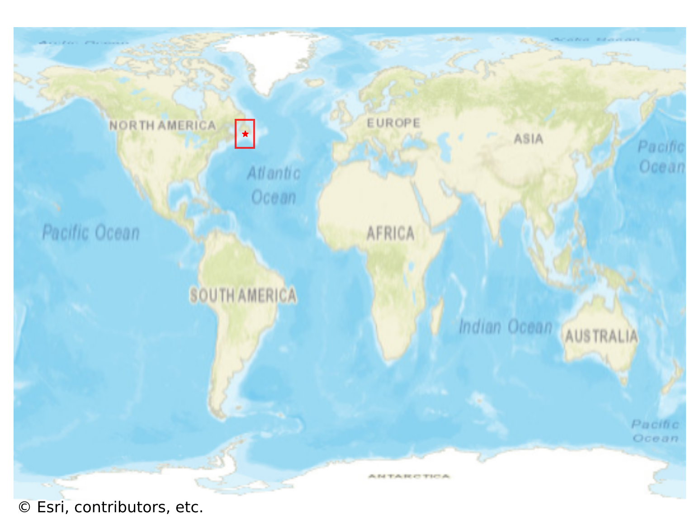
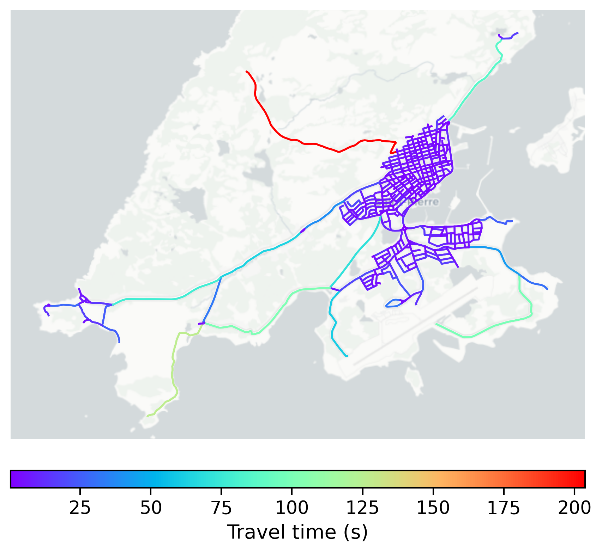

# SaintPierre, Saint Pierre and Miquelon

#### Location Information

- **City**: SaintPierre
- **Country**: Saint Pierre and Miquelon
- **Data Source**: OpenStreetMap

- **Analysis Date**: 2025-10-10

#### Road network topology

#### Network Characteristics

##### Basic Topology

- **Number of Nodes**: 489
- **Number of Edges**: 1,326
- **Network Density**: 0.005557
- **Average Node Degree**: 5.423
- **Standard Deviation of Node Degrees**: 1.742

##### Clustering Properties

- **Global Clustering Coefficient**: 0.057348
- **Average Local Clustering Coefficient**: 0.063296
- **Degree Assortativity Coefficient**: 0.346444

##### Spatial Metrics

- **Total Network Length (meters)**: 129063.80
- **Average Edge Length (meters)**: 97.33
- **Average Travel Time per Edge (seconds)**: 6.55

---
*Report generated on 2025-10-10 18:28:33*
